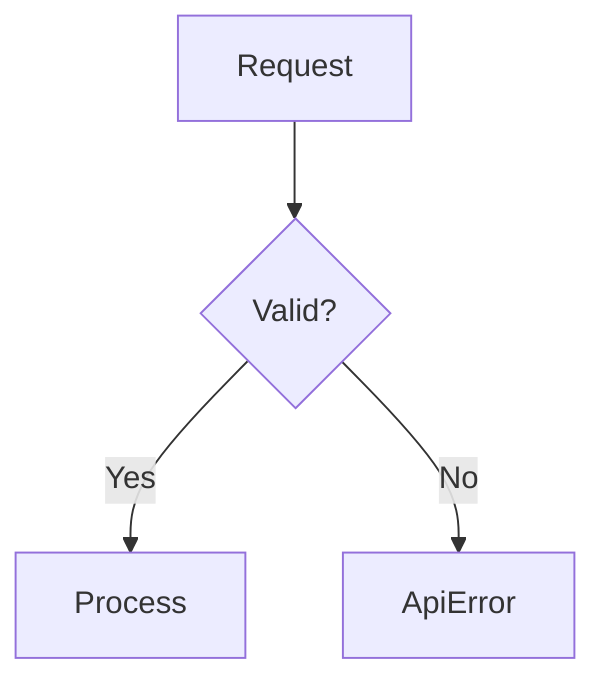

# Plan 009: MUR Editor UX — Web Dashboard + Enhanced CLI

> Version: 1.0
> Date: 2026-02-25
> Status: Draft
> Author: David + Claude (brainstorming session)

## Executive Summary

Transform MUR's pattern/workflow editing experience from raw YAML file editing into a multi-modal interface: a web-based SPA (deployable to Cloudflare Pages) with Visual and Source editing modes, a local `mur serve` backend, and enhanced CLI interactions. The SPA connects to either localhost (local mode) or mur-server (cloud mode), using a unified API schema.

**Goals:**
1. Visual Mode: form-based GUI editing (mouse-driven, zero learning curve)
2. Source Mode: Markdown/YAML/TOML editing with syntax highlighting + live preview
3. Hybrid deployment: same SPA works locally (mur serve) and remotely (mur.run)
4. Enhanced CLI: interactive `mur new`, edit preview/diff, templates, auto-suggestions
5. Language detection: auto-detect pattern language, i18n CLI output, same-language injection priority

**Non-goals (deferred):**
- Real-time collaboration / multi-user editing
- Mobile-native app (web responsive is sufficient)
- AI-powered content generation in editor (keep it pure)

---

## Architecture Overview

```
┌─────────────────────────────────────────────────────┐
│                 mur.run SPA                          │
│          (Svelte 5 + Tailwind + Vite)               │
│                                                      │
│   ┌─────────────┐    ┌──────────────┐               │
│   │ Visual Mode │◄──►│ Source Mode  │               │
│   │ (forms/GUI) │    │ (CodeMirror) │               │
│   └──────┬──────┘    └──────┬───────┘               │
│          └────────┬─────────┘                        │
│                   ▼                                  │
│          Unified API Client                          │
│          (base URL switchable)                       │
└──────────┬────────────────────┬──────────────────────┘
           │                    │
           ▼                    ▼
   localhost:3847          mur-server.fly.dev
   (mur serve / Rust)     (Go / PostgreSQL)
   reads ~/.mur/           reads cloud DB
```

### Data Source Switching

```
On SPA load:
  1. Try fetch("http://localhost:3847/api/v1/health")
     → Success → default to Local mode 🟢
  2. Fail → check auth token in localStorage
     → Valid → Cloud mode ☁️
  3. Neither → Read-only demo mode 👀

User can manually switch via UI toggle at any time.
```

---

## Phase 0: `mur serve` — Local API Server (Rust)

**Duration:** 3-4 days
**New file:** `mur-core/src/server.rs`
**Dependencies:** `axum`, `tower-http` (CORS), `tokio`

### API Endpoints

```
GET    /api/v1/health
GET    /api/v1/patterns                  # list all (with filters)
GET    /api/v1/patterns/:id              # get one
POST   /api/v1/patterns                  # create
PUT    /api/v1/patterns/:id              # update
DELETE /api/v1/patterns/:id              # delete
GET    /api/v1/patterns/:id/history      # git log for pattern file
POST   /api/v1/patterns/:id/revert      # revert to version

GET    /api/v1/workflows                 # list workflows
GET    /api/v1/workflows/:id
POST   /api/v1/workflows
PUT    /api/v1/workflows/:id
DELETE /api/v1/workflows/:id

GET    /api/v1/stats                     # dashboard stats
GET    /api/v1/stats/injections          # injection history
GET    /api/v1/tags                      # all unique tags
GET    /api/v1/links/:id                 # pattern links

POST   /api/v1/search                    # hybrid search
POST   /api/v1/evolve                    # trigger evolve
POST   /api/v1/export                    # bulk export (md/yaml/toml)
POST   /api/v1/import                    # bulk import
```

### Response Format

```json
{
  "data": { ... },
  "meta": {
    "source": "local",
    "version": "2.0.0-alpha.6",
    "pattern_count": 242
  }
}
```

### CORS Configuration

```rust
// Allow localhost SPA dev + mur.run production
let cors = CorsLayer::new()
    .allow_origin([
        "http://localhost:5173",      // vite dev
        "https://mur.run",
        "https://www.mur.run",
    ])
    .allow_methods(Any)
    .allow_headers(Any);
```

### CLI Integration

```bash
mur serve                    # start on :3847
mur serve --port 4000        # custom port
mur serve --open             # start + open browser
mur serve --readonly         # no write operations
```

### Implementation Notes

- Reuse existing `YamlStore` and `WorkflowYamlStore` for persistence
- Pattern history via `git2` crate (libgit2 bindings) — read git log of each YAML file
- Auto-commit on every write operation: `git add <file> && git commit -m "mur: update <pattern-id>"`
- Serve static SPA files from embedded assets (rust-embed) or `--static-dir` flag

### Tests

- [ ] API CRUD for patterns (create, read, update, delete)
- [ ] API CRUD for workflows
- [ ] Search endpoint returns ranked results
- [ ] CORS headers present
- [ ] History endpoint returns git log
- [ ] Readonly mode rejects writes

---

## Phase 1: SPA — Project Scaffold + Pattern List (Svelte)

**Duration:** 3-4 days
**New repo:** `mur-run/mur-web` (or `mur/mur-web` workspace member)
**Deploy:** Cloudflare Pages (mur.run)

### Tech Stack

| Layer | Choice | Reason |
|-------|--------|--------|
| Framework | Svelte 5 | Lightest bundle, great DX, runes reactivity |
| Styling | Tailwind CSS 4 | Utility-first, fast iteration |
| Editor | CodeMirror 6 | Source mode, syntax highlighting |
| Diagrams | Mermaid.js | Inline diagram preview |
| Icons | Lucide | Clean, consistent |
| Build | Vite | Fast, CF Pages compatible |
| HTTP | Built-in fetch | No axios needed |

### Pages

```
/                       → Dashboard (stats overview)
/patterns               → Pattern list (filterable, searchable)
/patterns/:id           → Pattern detail + editor
/patterns/new           → New pattern (template picker)
/workflows              → Workflow list
/workflows/:id          → Workflow detail + editor
/settings               → Data source, language, theme
```

### Pattern List View

```
┌─ Patterns ──────────────────────────── [+ New] ─────┐
│                                                      │
│ Search: [________________________] [🔍]              │
│                                                      │
│ Filters:                                             │
│ Maturity: [All▾]  Tier: [All▾]  Tags: [________▾]  │
│ Sort: [Confidence▾]  Language: [All▾]               │
│                                                      │
│ ┌─ ⭐ rust-error-handling ──────── Stable  82% ────┐ │
│ │ Use thiserror for library errors and anyhow...   │ │
│ │ 🏷️ rust, backend  📈 47 injections              │ │
│ └──────────────────────────────────────────────────┘ │
│                                                      │
│ ┌─ 🟡 svelte-state-mgmt ──────── Emerging  71% ───┐ │
│ │ Use Svelte 5 runes ($state, $derived) instead... │ │
│ │ 🏷️ svelte, frontend  📈 12 injections           │ │
│ └──────────────────────────────────────────────────┘ │
│                                                      │
│ ┌─ 📝 go-context-patterns ─────── Draft  55% ─────┐ │
│ │ Always pass context.Context as first param...    │ │
│ │ 🏷️ go, backend  📈 3 injections                 │ │
│ └──────────────────────────────────────────────────┘ │
│                                                      │
│ Showing 1-20 of 242  [◀ 1 2 3 ... 13 ▶]            │
└──────────────────────────────────────────────────────┘
```

### Features

- **Instant filter**: typing in search box filters client-side (all patterns loaded)
- **Tag cloud**: sidebar shows all tags with counts, click to filter
- **Batch actions**: select multiple → bulk tag, bulk delete, bulk export
- **Drag to reorder** (when sorted by custom order)
- **Keyboard nav**: `j/k` up/down, `Enter` to open, `/` to focus search

### Tests

- [ ] Pattern list renders with mock data
- [ ] Search filters correctly
- [ ] Tag/maturity/tier filters work
- [ ] Pagination works
- [ ] Data source switching (local ↔ cloud ↔ demo)

---

## Phase 2: Visual Editor Mode

**Duration:** 4-5 days

### Component Breakdown

```
PatternEditor.svelte
├── EditorToolbar.svelte        # Save, Cancel, Delete, Mode toggle
├── VisualEditor.svelte         # Form-based editing
│   ├── DescriptionField.svelte # Rich text area
│   ├── TagChips.svelte         # Tag/trigger chip input with autocomplete
│   ├── TierSelector.svelte     # Radio button group
│   ├── ConfidenceSlider.svelte # Range slider with numeric display
│   ├── ExampleList.svelte      # Code blocks with add/edit/delete/reorder
│   │   └── CodeBlock.svelte    # Syntax-highlighted code with language selector
│   ├── DiagramList.svelte      # Mermaid/PlantUML with live preview
│   ├── MetadataPanel.svelte    # Read-only stats (injections, links, dates)
│   └── RelatedPatterns.svelte  # Sidebar: linked/similar patterns
├── SourceEditor.svelte         # CodeMirror-based (Phase 3)
└── DiffPreview.svelte          # Before-save diff view
```

### Visual Editor Features

#### A. Tag/Trigger Chips (`TagChips.svelte`)
```
[rust ×] [api ×] [error ×]  [+ type to add... ▾]
                              ┌────────────────┐
                              │ error-handling  │ ← autocomplete from
                              │ error-recovery  │   existing tags
                              │ error-boundary  │
                              └────────────────┘
```
- Type to filter existing tags
- Enter to add (new or existing)
- Click × or Backspace to remove
- Drag to reorder
- Color-coded: existing tags (blue), new tags (green)

#### B. Confidence Slider (`ConfidenceSlider.svelte`)
```
Confidence  [━━━━━━━━░░░░] 0.82
             ▲ drag handle

Color zones:
  0.0-0.3  red    (low confidence)
  0.3-0.6  yellow (moderate)
  0.6-1.0  green  (high confidence)
```

#### C. Example Code Blocks (`ExampleList.svelte`)
```
Examples                                    [+ Add Example]

┌─ Example 1 ──── Language: [Rust ▾] ── [⬆] [⬇] [🗑] ─┐
│                                                        │
│  #[derive(thiserror::Error, Debug)]                    │
│  enum ApiError {                                       │
│      #[error("not found: {0}")]                        │
│      NotFound(String),                                 │
│  }                                                     │
│                                                        │
│  [Edit] [Copy]                                         │
└────────────────────────────────────────────────────────┘
```
- Click Edit → inline CodeMirror editor appears
- Language auto-detected, manually overridable
- Syntax highlighting via CodeMirror language packs
- Reorder via drag or arrow buttons

#### D. Diagram Preview (`DiagramList.svelte`)
```
Diagrams                                    [+ Add Diagram]

┌─ error-flow.mermaid ──────────────────────────────────┐
│  [Source]  [Preview]                                   │
│                                                        │
│  Preview mode:                                         │
│  ┌──────────────────────────────────────┐              │
│  │    ┌─────┐    ┌──────────┐          │              │
│  │    │Start│───▶│Validate  │          │              │
│  │    └─────┘    └────┬─────┘          │              │
│  │                    │                │              │
│  │              ┌─────▼─────┐          │              │
│  │              │  Handle   │          │              │
│  │              └───────────┘          │              │
│  └──────────────────────────────────────┘              │
└────────────────────────────────────────────────────────┘
```
- Source/Preview toggle
- Mermaid.js renders inline
- PlantUML renders via a lightweight server or Mermaid fallback

#### E. Related Patterns Sidebar (`RelatedPatterns.svelte`)
```
┌─ Related ─────────────────────────┐
│                                    │
│ 🔗 Linked (3)                     │
│ ├── rust-result-types    0.91 ⭐  │
│ ├── error-recovery       0.67 🟡  │
│ └── axum-error-handler   0.78 ⭐  │
│                                    │
│ 💡 Suggested (2)                  │
│ ├── go-error-wrapping    sim:0.72 │
│ └── typescript-errors    sim:0.65 │
│                                    │
│ [Click to view / Link]            │
└────────────────────────────────────┘
```
- Shows existing links + AI-suggested similar patterns
- Click to navigate, button to create link

#### F. Diff Preview Before Save (`DiffPreview.svelte`)
```
┌─ Review Changes ──────────────────────────────────────┐
│                                                        │
│   confidence:  0.82 → 0.90                            │
│   tags:        + "web-api"                            │
│   description: ~ "Use thiserror for library errors    │
│                   and anyhow for application-level     │
│                +  error handling in Rust web APIs."    │
│   examples:    + [new example added]                  │
│                                                        │
│   [Apply]  [Edit More]  [Discard]                     │
└────────────────────────────────────────────────────────┘
```

#### G. Conflict Detection (inline)
```
⚠️ Potential Conflict Detected

Your edit says:
  "Always use anyhow in libraries"

Existing pattern 'rust-lib-errors' says:
  "Never use anyhow in libraries, use thiserror"

[Ignore]  [View Conflicting Pattern]  [Merge]
```
- Triggered on save, not real-time (to avoid noise)
- Uses keyword overlap + negation detection (existing mur logic)

### Tests

- [ ] Visual editor renders all fields
- [ ] Tag autocomplete shows existing tags
- [ ] Confidence slider updates value
- [ ] Code block syntax highlighting works
- [ ] Mermaid diagram renders in preview
- [ ] Diff preview shows correct changes
- [ ] Conflict detection catches contradictions
- [ ] Related patterns sidebar loads

---

## Phase 3: Source Editor Mode

**Duration:** 3-4 days

### Format Support

```
┌─ Editor Mode ──────── Visual │ Source ─────────────────┐
│                                                        │
│  Format: ● Markdown  ○ YAML  ○ TOML                  │
│                                                        │
```

#### Markdown Format (Hugo-style frontmatter)

```markdown
---
id: rust-error-handling
triggers:
  - rust
  - api
  - error
tags: [rust, backend]
tier: project
confidence: 0.82
maturity: stable
---

# Error Handling in Rust APIs

Use **thiserror** for library errors and **anyhow** for
application-level error handling.

## Examples

```rust
#[derive(thiserror::Error, Debug)]
enum ApiError {
    #[error("not found: {0}")]
    NotFound(String),
}
```

## Diagrams


```

#### YAML Format (current storage format, as-is)

#### TOML Format

```toml
id = "rust-error-handling"
triggers = ["rust", "api", "error"]
tags = ["rust", "backend"]
tier = "project"
confidence = 0.82
maturity = "stable"

[knowledge]
description = "Use thiserror for library errors..."

[[examples]]
language = "rust"
code = """
#[derive(thiserror::Error, Debug)]
..."""
```

### CodeMirror 6 Configuration

```typescript
const extensions = [
  // Language support (auto-switch based on format)
  yaml(),  // or markdown(), or toml via @codemirror/lang-json workaround
  
  // Features
  lineNumbers(),
  foldGutter(),
  bracketMatching(),
  autocompletion({
    override: [murTagCompletion, murTriggerCompletion]
  }),
  lintGutter(),
  
  // Theme
  oneDark,  // or user-selected theme
  
  // Custom
  murFrontmatterHighlight(),  // highlight YAML frontmatter in MD mode
  murDiagramPreview(),        // inline mermaid preview
]
```

### Format Conversion (lossless)

```
Markdown → internal PatternData → YAML
YAML → internal PatternData → Markdown
TOML → internal PatternData → Markdown

Conversion goes through PatternData struct to ensure no data loss.
If conversion fails → show error inline, don't switch format.
```

### Implementation

- **Parser:** Markdown frontmatter → `gray-matter`-equivalent (JS) or custom parser
- **Serializer:** `PatternData` → each format
- **Validation:** real-time lint via CodeMirror lint extension
  - Missing required fields (id, triggers)
  - Invalid YAML indentation
  - Unknown fields (warning, not error)
  - Confidence out of range

### Tests

- [ ] Markdown → YAML → Markdown roundtrip is lossless
- [ ] YAML → TOML → YAML roundtrip is lossless
- [ ] CodeMirror loads with correct language mode
- [ ] Lint highlights errors inline
- [ ] Autocomplete suggests existing tags/triggers
- [ ] Format switch preserves all data

---

## Phase 4: Enhanced CLI Editing

**Duration:** 2-3 days
**Changes to:** `mur-core/src/main.rs` + new `mur-core/src/interactive.rs`

### A. `mur new --interactive` (default when TTY)

```rust
// Detect TTY and default to interactive
fn cmd_new(diagram: Option<String>) -> Result<()> {
    if atty::is(Stream::Stdin) && diagram.is_none() {
        return cmd_new_interactive();
    }
    // ... existing non-interactive flow
}
```

**Flow:**

```
$ mur new

  🆕 Create New Pattern

  What did you learn? (describe the pattern)
  > Always pass context.Context as first parameter in Go functions

  When should this be triggered? (comma-separated keywords)
  > go, context, function signature

  Confidence (0.0-1.0) [0.7]:
  > ↵  (accept default)

  Tier:
  ❯ Session    (this session only)
    Project    (this project)
    Global     (everywhere)

  Template:
  ❯ 💡 Insight      (observation or lesson)
    🔧 Technique    (how-to with examples)
    ⚠️  Pitfall      (mistake to avoid)
    📋 Checklist    (step-by-step)
    📖 Custom       (blank)

  Add a code example? [y/N]
  > y
  Language [go]:
  > ↵
  Paste code (empty line to finish):
  > func GetUser(ctx context.Context, id string) (*User, error) {
  >     // ctx is always first
  > }
  >

  ✅ Created: go-context-first-param
     Maturity: Draft | Tier: Project | Confidence: 0.70
     File: ~/.mur/patterns/go-context-first-param.yaml

  💡 Tip: `mur edit go-context-first-param` to refine
         `mur serve --open` to edit in browser
```

**Dependencies:** `dialoguer` crate (Select, Input, Confirm, Editor)

### B. `mur edit` Preview + Diff

```
$ mur edit rust-error-handling

  ┌─ rust-error-handling ─────────────────────────────┐
  │ Maturity: Stable ⭐  Confidence: 0.82             │
  │ Tier: Project     Tags: rust, backend             │
  │ Injections: 47    Last used: 2 days ago           │
  │                                                    │
  │ "Use thiserror for library errors and anyhow      │
  │  for application-level error handling."            │
  │                                                    │
  │ [e]dit in $EDITOR                                 │
  │ [b]rowser (open mur serve)                        │
  │ [q]uick edit (inline fields)                      │
  │ [d]elete                                          │
  │ [c]ancel                                          │
  └───────────────────────────────────────────────────┘
  >
```

After editing:

```
  📝 Changes:
    confidence:  0.82 → 0.90
    description: + "in Rust web APIs"
    examples:    + 1 new example

  Apply changes? [Y/n/e(dit again)]
```

### C. Quick Edit (inline)

```
$ mur edit rust-error-handling --quick

  Which field?
  ❯ description
    triggers
    tags
    tier
    confidence
    examples

  # Select 'confidence'
  Current: 0.82
  New value: 0.90

  ✅ Updated confidence: 0.82 → 0.90
```

### D. Templates

```
~/.mur/templates/
├── insight.yaml
├── technique.yaml
├── pitfall.yaml
├── checklist.yaml
└── custom.yaml    (user-created)
```

Ship default templates, users can add their own.

### E. `mur why <pattern-id>`

```
$ mur why rust-error-handling

  📊 Why was this pattern injected?

  Last injection: 2026-02-25 14:32:07 (session #892)

  Matching signals:
    🔑 Trigger match:  "rust" (in prompt) × "error" (in tool output)
    🏷️  Tag overlap:    rust, backend (2/2 matched)
    🧠 Semantic:       0.84 similarity to query
    📈 Confidence:     0.82 (above 0.5 threshold)
    ⭐ Maturity:       Stable (1.5× boost)

  Combined score: 0.87 (rank #2 of 47 candidates)

  Gate results:
    ✅ Confidence gate (0.82 > 0.5)
    ✅ Relevance gate  (0.84 > 0.3)
    ✅ Not muted
    ✅ Not archived
```

### Tests

- [ ] `mur new` interactive flow completes
- [ ] `mur new --no-interactive` skips prompts
- [ ] `mur edit` shows preview
- [ ] `mur edit` diff is correct
- [ ] `mur why` shows injection reasoning
- [ ] Templates load from ~/.mur/templates/

---

## Phase 5: Language Detection & i18n

**Duration:** 2-3 days

### A. Pattern Language Detection

**Crate:** `whatlang` (pure Rust, 69 languages, ~100KB)

```rust
use whatlang::detect;

fn detect_pattern_language(kb: &KnowledgeBase) -> Option<String> {
    let text = format!("{} {}", kb.description, kb.context.as_deref().unwrap_or(""));
    detect(&text).map(|info| info.lang().to_code().to_string())
}
```

- Auto-detect on `mur new` and `mur learn`
- Store in pattern YAML: `language: "zh"` / `language: "en"`
- `#[serde(default)]` — old patterns without field = `None` (detect on next evolve)

### B. Same-Language Injection Priority

In `retrieve.rs` scoring:

```rust
// Boost patterns matching session language
if let Some(pattern_lang) = &pattern.knowledge.language {
    if let Some(session_lang) = &context.detected_language {
        if pattern_lang == session_lang {
            score *= 1.2;  // 20% boost for same language
        }
    }
}
```

Session language detected from the last N user messages in context.

### C. CLI i18n

**Crate:** `rust-i18n` or `sys-locale` + simple lookup

```
~/.mur/config.yaml:
  locale: zh-TW    # or auto-detect from $LANG

CLI output:
  en: "✅ Created: go-context-first-param"
  zh: "✅ 已建立：go-context-first-param"
  ja: "✅ 作成しました：go-context-first-param"
```

**Scope:** CLI messages only (not pattern content). Start with `en` + `zh-TW`, add more later.

### D. Web UI i18n

- Use Svelte's `$t()` with JSON locale files
- Auto-detect from `navigator.language`
- Toggle in Settings page

### Tests

- [ ] Language detection works for English, Chinese, Japanese
- [ ] Same-language boost affects scoring
- [ ] CLI respects locale setting
- [ ] Unknown language falls back to English

---

## Phase 6: Import/Export Ecosystem

**Duration:** 2-3 days

### Import Sources

```bash
mur import file.md                    # Markdown pattern(s)
mur import file.yaml                  # YAML pattern(s)
mur import .cursorrules               # Cursor rules → patterns
mur import CLAUDE.md                  # Claude project docs → patterns
mur import AGENTS.md                  # OpenClaw agents → patterns
mur import --url https://...          # Remote URL
mur import --dir ./patterns/          # Directory of files
```

**Conversion logic:**
- `.cursorrules` → split by `---` or `##` headings → one pattern per section
- `CLAUDE.md` / `AGENTS.md` → split by `##` headings → one pattern per section
- Each imported pattern: `maturity: draft`, `confidence: 0.5`, auto-detect triggers from content

### Export Formats

```bash
mur export --format markdown          # All patterns as .md files
mur export --format yaml              # All patterns as .yaml (default)
mur export --format toml              # All patterns as .toml
mur export --format cursorrules       # Merge into single .cursorrules
mur export --format claudemd          # Merge into single CLAUDE.md
mur export --id rust-error-handling   # Single pattern
mur export --tag rust                 # Filter by tag
mur export --tier global              # Filter by tier
```

### Web UI Import

```
┌─ Import ─────────────────────────────────────────────┐
│                                                       │
│  Drop files here or click to browse                  │
│  ┌─ ─ ─ ─ ─ ─ ─ ─ ─ ─ ─ ─ ─ ─ ─ ─ ─ ─ ─ ─ ─ ─┐  │
│  │                                                │  │
│  │         📄 .yaml  .md  .toml                   │  │
│  │         📋 .cursorrules  CLAUDE.md             │  │
│  │                                                │  │
│  └─ ─ ─ ─ ─ ─ ─ ─ ─ ─ ─ ─ ─ ─ ─ ─ ─ ─ ─ ─ ─ ─┘  │
│                                                       │
│  Or paste URL: [_______________________________]     │
│                                                       │
│  Preview (3 patterns detected):                      │
│  ☑ rust-error-handling     "Use thiserror..."        │
│  ☑ go-context-patterns     "Always pass ctx..."      │
│  ☐ typescript-basics       "Use strict mode..."      │
│                                                       │
│  [Import Selected (2)]  [Import All]  [Cancel]       │
└───────────────────────────────────────────────────────┘
```

### Tests

- [ ] Import .cursorrules creates correct patterns
- [ ] Import CLAUDE.md splits by headings
- [ ] Export Markdown → Import Markdown roundtrip
- [ ] Export cursorrules generates valid format
- [ ] Web drag-and-drop triggers import flow

---

## Implementation Timeline

```
Week 1: Phase 0 (mur serve) + Phase 1 (SPA scaffold + list)
         ├── Day 1-2: mur serve API in Rust (axum)
         ├── Day 3-4: Svelte project + pattern list page
         └── Day 5: Data source switching, deploy to CF Pages

Week 2: Phase 2 (Visual Editor)
         ├── Day 1-2: Core editor components (description, tags, tier)
         ├── Day 3: Code blocks + diagram preview
         ├── Day 4: Related patterns + conflict detection
         └── Day 5: Diff preview + save flow

Week 3: Phase 3 (Source Editor) + Phase 4 (CLI)
         ├── Day 1-2: CodeMirror integration + format switching
         ├── Day 3: mur new interactive + templates
         ├── Day 4: mur edit preview/diff + mur why
         └── Day 5: Polish + edge cases

Week 4: Phase 5 (i18n) + Phase 6 (Import/Export)
         ├── Day 1: whatlang integration + scoring boost
         ├── Day 2: CLI i18n (en + zh-TW)
         ├── Day 3-4: Import/export formats
         └── Day 5: Web import UI + testing
```

**Total: ~4 weeks, ~20 working days**

---

## Cargo Dependencies (new)

```toml
# mur-core/Cargo.toml additions

# Phase 0: server
axum = "0.8"
tower-http = { version = "0.6", features = ["cors", "fs"] }
tokio = { version = "1", features = ["full"] }
rust-embed = "8"

# Phase 4: interactive CLI
dialoguer = "0.11"
atty = "0.2"
console = "0.15"

# Phase 5: language detection
whatlang = "0.16"
sys-locale = "0.3"
```

## NPM Dependencies (mur-web)

```json
{
  "devDependencies": {
    "@sveltejs/kit": "^2",
    "@sveltejs/adapter-static": "^3",
    "tailwindcss": "^4",
    "vite": "^6"
  },
  "dependencies": {
    "codemirror": "^6",
    "@codemirror/lang-yaml": "^6",
    "@codemirror/lang-markdown": "^6",
    "mermaid": "^11",
    "lucide-svelte": "^0.5"
  }
}
```

---

## Success Criteria

1. **`mur serve --open`** opens browser with full pattern list in <2 seconds
2. **Visual Editor** can create/edit/delete patterns without touching YAML
3. **Source Editor** supports Markdown/YAML/TOML with lossless conversion
4. **Same SPA** works on mur.run (cloud) and localhost (local)
5. **`mur new`** interactive flow takes <30 seconds to create a pattern
6. **`mur why`** clearly explains every injection decision
7. **Language detection** correctly identifies zh/en/ja in patterns
8. **Import from .cursorrules** works with zero configuration
9. **246 existing tests** still pass, **+50 new tests** for server/CLI
10. **Bundle size** < 200KB gzipped (SPA)

---

## Risk & Mitigation

| Risk | Impact | Mitigation |
|------|--------|-----------|
| CodeMirror bundle too large | Slow load | Lazy-load Source mode |
| Git history per-pattern is slow | UX lag | Cache + limit to last 20 versions |
| Markdown parsing edge cases | Data loss | Always keep YAML as source of truth |
| CORS issues with localhost | Blocks local mode | Fallback to same-origin proxy |
| Svelte 5 breaking changes | Dev friction | Pin version, follow migration guide |

---

## Open Questions

1. **Repo structure**: New `mur-web` repo or `mur/mur-web` workspace member?
   - Recommendation: separate repo (different toolchain: Node vs Rust)
2. **Auth for web UI**: Local mode = no auth, Cloud mode = mur-server device code auth?
3. **Offline support**: Service worker + IndexedDB cache for cloud mode?
4. **Custom domain**: mur.run already owned? Or use mur-server.fly.dev/ui ?
