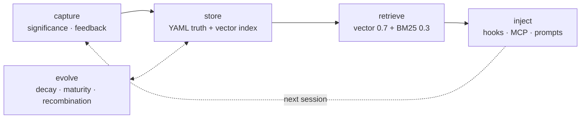
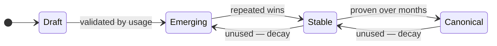
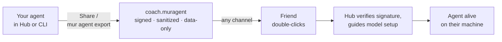

<div align="center">


# MUR

**The local-first AI agent platform, in native Rust.**

Run a fleet of specialized AI agents on the machine you already own — agents that
learn from every session, speak with an on-device voice, plug into the AI tools
you already use, and can be handed to a friend as a single file.

[](https://github.com/mur-run/mur/actions/workflows/ci.yml)
[](https://github.com/mur-run/mur/releases/latest)
[](LICENSE)


[Quick start](#-quick-start) · [Features](#-what-can-a-mur-agent-do) · [Architecture](#-architecture) · [CLI](#-cli-at-a-glance) · [Docs](https://app.mur.run/docs/core) · [Website](https://mur.run)

</div>

---

## What is MUR?

Every AI tool you use today is stateless and cloud-tethered: each session starts
from zero, and the agent lives in someone else's datacenter. MUR inverts both
assumptions.

MUR runs **specialized agents as long-lived local processes** — each with its own
model binding, system prompt, MCP servers, skills, schedule, voice, and
permissions — supervised by one small Rust runtime speaking
[A2A v0.3](https://github.com/a2aproject/A2A). On top of the runtime sits a
**memory pipeline with a maturity lifecycle**: what an agent learns in one
session is captured, scored, stored as plain YAML, retrieved by hybrid semantic
search, and injected into the next session — and it decays when it stops being
useful, so no junk accumulates.

You talk to your fleet through the **MUR Hub** desktop app (chat, approvals,
desktop pets), by **voice**, from an **iPhone**, from the **terminal**, or
through **Slack / Telegram / Jira**. And when an agent becomes genuinely useful,
you can **export it as a signed `.muragent` file** and give it to someone who has
never heard of MUR.

> **In one line:** a native-Rust, local-first fleet of specialized AI agents that
> learn and evolve — light enough to be always-on on the Mac you already own, and
> each exportable as a companion you can hand to anyone.

### Why local-first?

- **It fits on your machine.** ~200K lines of native Rust — no Electron, no
  Python sidecar. An always-on fleet plus a local LLM fits in consumer RAM.
- **Marginal cost ≈ 0.** Inference runs on your hardware. Everything local is
  free, with no per-token meter.
- **Privacy is structural, not a setting.** Memory, recordings, telemetry, and
  voice stay under `~/.mur/`. Logs pass through a redaction chokepoint before
  they touch disk, and a compile-time test forbids the companion module from
  importing network clients.

### How MUR compares

| Capability | MUR | Agent harnesses<br>(Archon, …) | Coding agents<br>(Claude Code, Cursor) | Memory layers<br>(Mem0, Zep, …) |
|---|:-:|:-:|:-:|:-:|
| Local-first multi-agent runtime (native Rust) | ✅ | ✗ | ✗ | ✗ |
| Memory that evolves (decay + Draft→Canonical lifecycle) | ✅ | ✗ | ✗ | partial |
| Kernel sandbox (Landlock / seccomp / SBPL / Job Object) | ✅ | ✗ | ✗ | ✗ |
| Export an agent as a giveable artifact | ✅ | ✗ | ✗ | ✗ |
| On-device voice, DND-aware | ✅ | ✗ | ✗ | ✗ |
| Feeds learning into 16+ existing AI tools | ✅ | ✗ | partial | ✗ |

---

## 🚀 Quick start

### The 5-minute path — MUR Hub (macOS, Apple Silicon)

1. Download **[MUR-Hub-aarch64-apple-darwin.dmg](https://github.com/mur-run/mur/releases/latest)** from the latest release.
2. Drag **MUR Hub** into Applications and open it.
3. Say hi — the built-in concierge agent **MUR** is alive immediately: **offline,
   no API key, no signup**, running on a bundled local multimodal model.

Received a `.muragent` file from a friend? **Double-click it.** Hub verifies the
signature, walks you through model setup, and the agent comes alive.

> Power users: Hub menu → *Install Command-Line Tools…* puts `mur` on your `PATH`.

### The CLI path

```bash
# macOS / Linux
curl -fsSL https://mur.run/install.sh | sh

# Windows (PowerShell)
irm https://mur.run/install.ps1 | iex

# Homebrew (macOS arm64)
brew install mur-run/tap/mur

# From source
cargo install mur-core        # installs the `mur` binary
```

```bash
mur init                                      # interactive setup wizard
mur agent create coach --model llama3.2:3b    # create an agent (default provider: ollama)
mur agent install-service coach               # run it as a launchd/systemd user service
mur agent cli coach                           # streaming TUI chat with tool approvals
                                              #   --resume continues the last conversation
```

### Teach the AI tools you already use

MUR's memory layer works even if you never create an agent — it rides along with
Claude Code, Codex, Cursor, Gemini-family CLIs, and a dozen more:

```bash
mur init --hooks                              # install hooks for detected AI tools
mur sync                                      # write learned patterns into each tool's native config
mur notes search "how we handle auth errors"  # query your accumulated memory
```

---

## ✨ What can a MUR agent do?

### 🤖 Run as a real local process

One BusyBox-style runtime binary, one symlink per agent (`mur_agent_coach`).
Each agent owns its model binding (Ollama, MLX, Anthropic, OpenAI, … via the
`~/.mur/models.yaml` registry), system prompt, MCP servers, skills,
keychain-backed secrets, cron schedules, webhook receiver, and a rotating Ed25519
identity. `mur agent` exposes 40+ subcommands for the full lifecycle — create,
chat, export, schedule, permissions, telemetry, trash, rollback.

### 🧠 Learn — and forget — like a teammate

<p align="center"></p>



Knowledge moves through a maturity lifecycle driven by real usage, with decay
half-lives by tier (session 14d / project 90d / core 365d):



Recurring tool sequences across sessions are mined into **suggested workflows**
(`mur workflow suggest`) — no drag-and-drop DAG editor, no marketplace; your own
recorded behavior is the authoring tool.

### 💬 Be everywhere you are

- **MUR Hub** — multi-conversation rail across the fleet, streaming replies,
  human-in-the-loop tool approvals, dashboards, and drag-out **desktop pets**
  with expressions and speech bubbles.
- **Voice** — fully on-device TTS (Kokoro 82M) + STT (whisper.cpp); respects
  Do Not Disturb, Focus, and a busy microphone.
- **iPhone** — the in-repo iOS companion (`mur-mobile-app`) pairs over LAN with
  `mur agent pair` (QR); off-LAN traffic falls back to a relay that forwards only
  end-to-end-signed envelopes. All AI stays on your Mac.
- **Watch together** — agents open videos in VLC, explain the current scene,
  analyze whole videos with timestamps, and (opt-in) comment on scene changes —
  on a local multimodal model.
- **Bridges** — Slack, Telegram, Jira (`@mur implement PROJ-123`), and webhooks.

### 🎁 Be given away



The `.muragent` package is DSSE-signed and **contains no executable code and no
secrets** — private keys and API keys are stripped at export. The recipient
installs MUR Hub once (signed + notarized); after that, agents travel as plain
files.

### 🔐 Stay governed

- **Kernel sandbox** per OS — Landlock + seccomp (Linux), SBPL (macOS), Job
  Object (Windows) — plus a DNS-resolver guard that filters network egress.
- **Human-in-the-loop** — tool calls pause for your approval in Hub and in
  `mur agent cli` (opt out per session with `--auto`).
- **Deletion safety** — destructive file actions go through a trash with a
  cancel window and explicit restore (`mur agent trash`); nothing is
  hard-deleted on a timer.
- **Auditability** — every action lands in an append-only JSONL ledger;
  **MUR Commander** (companion crate) adds an Ed25519-signed constitution and a
  hash-chained audit log for cross-network fleets.

### 🔌 Power the tools you already pay for

Three integration layers, by interaction shape:

| Layer | Shape | What it does |
|---|---|---|
| **Hooks** | fire-and-forget | `mur sync` writes memory into each tool's native config; session hooks inject context automatically |
| **MCP server** | interactive | `mur-mcp-server` (stdio) exposes 18 tools — search, recall, project code search, agent status, token compression, media control |
| **Skills** | teaching | curated manifests that tell agents *when and why* to reach for MUR |

Synced tools include Claude Code, Gemini CLI, Auggie, Cursor, Copilot CLI,
OpenClaw, OpenCode, Amp, Codex, Aider, Windsurf, Zed, Junie, Trae, Cline, and
Amazon Q. The compression tools (`mur_compress` / `mur_retrieve`) shrink large
payloads 40–80%, reversibly — originals stay retrievable by hash.

---

## 🦀 Architecture

<p align="center">
  
</p>

| Crate | Role |
|---|---|
| [`mur-core`](mur-core) | The `mur` CLI — memory pipeline, sync, sources, dashboard server, agent management |
| [`mur-common`](mur-common) | Shared types — `Pattern`, `Workflow`, A2A envelopes, `.muragent` format |
| [`mur-agent-runtime`](mur-agent-runtime) | Per-agent A2A v0.3 supervisor — sandbox, voice, export, telemetry |
| [`mur-daemon`](mur-daemon) | Always-on background daemon — queues, schedules, dashboard API |
| [`mur-mcp-server`](mur-mcp-server) | stdio MCP server exposing MUR to AI clients mid-conversation |
| [`mur-compress`](mur-compress) | Offline, reversible token compression |
| [`mur-gui-core`](mur-gui-core) | Shared GUI library — sidecar supervisor, companion bridge, A2A client |
| [`mur-agent-launcher`](mur-agent-launcher) | <100 KB per-agent stub (Dock identity, file association) |
| [`mur-mobile-sdk`](mur-mobile-sdk) | Rust mobile core (UniFFI → Swift/Kotlin) — transport, signed envelopes, audio framing |
| [`mur-hub-gui`](mur-hub-gui) | **MUR Hub** desktop app (Tauri 2 + React) |
| [`mur-mobile-app`](mur-mobile-app) | iOS voice companion (Swift) |

**MUR Commander** — the cross-network orchestration, governance, and
evaluation plane — ships as a separate crate.

On disk, everything lives under `~/.mur/`: agents, skills, notes, workflows, and
patterns as **human-readable, git-friendly YAML** (the source of truth), plus a
LanceDB vector index that is always rebuildable (`mur internals reindex`). No
opaque database lock-in.

---

## 🧰 CLI at a glance

```bash
mur daemon serve     # web dashboard at http://localhost:3847
mur dashboard        # terminal TUI dashboard
```

<details>
<summary><b>Full command tree</b> (23 top-level commands)</summary>

```
mur
├── init / doctor / update / stats / verify
├── agent        create · cli · send · card · export · install · companion · voice ·
│                pair · schedule · perm · secret · trash · queue · rollback … (40+)
├── skill        install · search · show · generate · suggest · evolve · recombine ·
│                publish · audit · trust · exchange · drafts · eval …
├── notes        create · search · list · show
├── workflow     run · suggest · list · schedule · show · search · new · publish · install
├── session      start · stop · record · status · list · review · show · export · push
├── sync         (16+ AI tools) · status · fleet pull/push/both
├── hook         unified hook entry for AI tools (prompt / tool / stop / session-start)
├── chat         conversations archive + ask
├── model        add · list · show · remove · migrate
├── source       external knowledge — Obsidian · Notion · Joplin
├── project      index · search   (semantic code search)
├── daemon       start · stop · status · serve · sleep
├── auth         login · logout
├── team         shared skills (private registries)
├── push / fetch signal outbox / inbox ↔ server
├── deploy       Docker Compose deployment
└── internals    low-level store access · reindex
```

</details>

---

## 🔨 Build from source

```bash
git clone https://github.com/mur-run/mur.git && cd mur

cargo build --workspace          # debug build (GUI apps are workspace-excluded)
cargo nextest run --workspace    # tests (CI uses nextest)
cargo clippy --workspace -- -D warnings

./build.sh                       # release build with the embedded web dashboard
./install.sh                     # build + install to /opt/homebrew/bin/mur
```

The two Tauri apps (`mur-hub-gui`, legacy `mur-agent-gui`) build from their own
manifests so the workspace build never pulls WebKitGTK / Cocoa / WebView2. The
iOS app builds with `mur-mobile-app/build-ios.sh`.

---

## 🧭 Roadmap

- **Cost-Router orchestrator** — route the easy ~80% of sub-tasks to local
  models and spawn a frontier coding agent (`claude` / `codex` / `agy`) only for
  the hard parts, as governed, sandboxed subprocesses. Spec merged; router in
  progress.
- **Fleet Sync (Pro)** — replicate your *evolved* fleet (profiles, skills,
  workflows, and their maturity/lifecycle state) across devices. Everything
  local stays free.
- **Hub on Windows / Linux**, and an **Android companion** from the same Rust
  mobile core.

Design history lives in [`docs/superpowers/specs/`](docs/superpowers/specs) and
[`docs/architecture/runtime-overview.md`](docs/architecture/runtime-overview.md).

---

## 🤝 Contributing

Issues and PRs are welcome — see [CONTRIBUTING.md](CONTRIBUTING.md).

```bash
cargo nextest run --workspace && cargo clippy --workspace -- -D warnings
```

## 📄 License

[MIT](LICENSE)

---

<div align="center">
<sub><b>Local first. Native Rust. Yours.</b></sub><br/>
<sub><a href="https://mur.run">mur.run</a> · <a href="https://app.mur.run/docs/core">Docs</a> · <a href="https://github.com/mur-run/mur/releases">Releases</a> · <a href="https://github.com/mur-run/mur/issues">Issues</a></sub>
</div>
