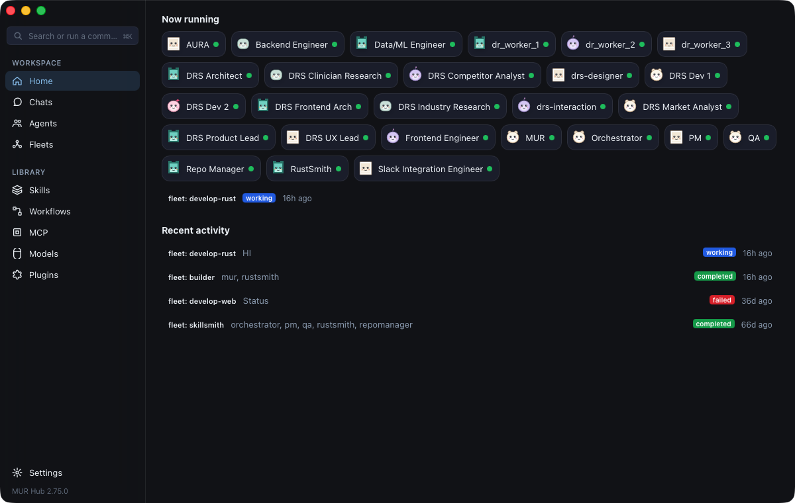
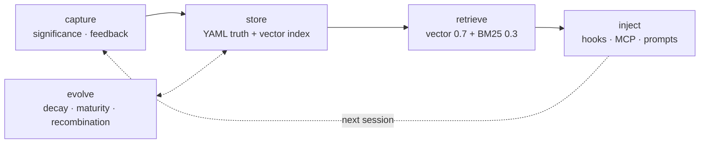
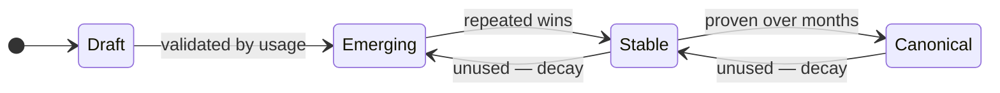
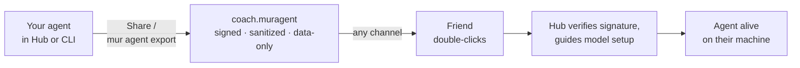
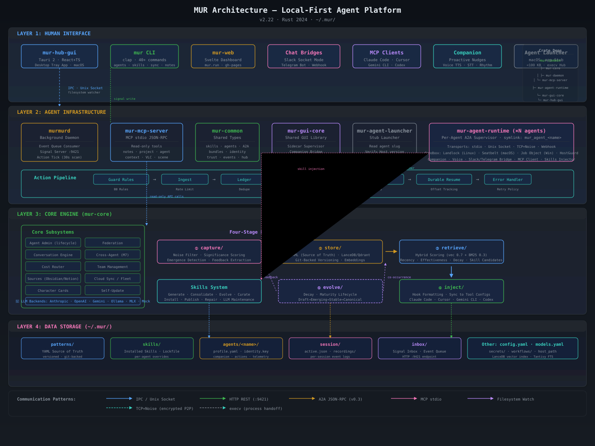

<div align="center">

<svg xmlns="http://www.w3.org/2000/svg" viewBox="300 120 780 560" width="200" height="143">
    <path fill="#001E32" d="M585.89,613.5l1.11,47c0.06,2.49-1.91,4.55-4.39,4.61c-2.49,0.06-4.55-1.91-4.61-4.39c0-0.07,0-0.15,0-0.21l1.11-47c0.04-1.87,1.6-3.35,3.47-3.31C584.4,610.23,585.84,611.7,585.89,613.5z"></path>
    <path fill="#001E32" d="M601.7,658.02l-21.48-18.15c-1.55-1.31-1.74-3.62-0.43-5.17c1.26-1.49,3.46-1.72,5-0.57l22.52,16.85c1.99,1.49,2.4,4.31,0.91,6.3c-1.49,1.99-4.31,2.4-6.3,0.91C601.84,658.14,601.76,658.08,601.7,658.02z"></path>
    <path fill="#001E32" d="M557.7,650.98l22.52-16.85c1.62-1.21,3.92-0.88,5.13,0.74c1.17,1.56,0.9,3.75-0.57,5l-21.48,18.15c-1.9,1.6-4.74,1.37-6.34-0.53c-1.6-1.9-1.37-4.74,0.53-6.34C557.55,651.09,557.63,651.03,557.7,650.98z"></path>
    <path fill="#001E32" d="M786.89,613.5l1.11,47c0.06,2.49-1.91,4.55-4.39,4.61c-2.49,0.06-4.55-1.91-4.61-4.39c0-0.07,0-0.15,0-0.21l1.11-47c0.04-1.87,1.6-3.35,3.47-3.31C785.4,610.23,786.84,611.7,786.89,613.5z"></path>
    <path fill="#001E32" d="M758.7,650.98l22.52-16.85c1.62-1.21,3.92-0.88,5.13,0.74c1.17,1.56,0.9,3.75-0.57,5l-21.48,18.15c-1.9,1.6-4.74,1.37-6.34-0.53c-1.6-1.9-1.37-4.74,0.53-6.34C758.55,651.09,758.63,651.03,758.7,650.98z"></path>
    <path fill="#001E32" d="M802.7,658.02l-21.48-18.15c-1.55-1.31-1.74-3.62-0.43-5.17c1.26-1.49,3.46-1.72,5-0.57l22.52,16.85c1.99,1.49,2.4,4.31,0.91,6.3c-1.49,1.99-4.31,2.4-6.3,0.91C802.84,658.14,802.76,658.08,802.7,658.02z"></path>
    <path fill="#58A6FF" d="M377.64,341.15l-54.89-12.2c-4.73-1.05-9.41,2.04-10.25,6.82c-3.05,17.39-2.64,54.92,58.14,53.38"></path>
    <path fill="#58A6FF" d="M988.36,341.15l54.89-12.2c4.73-1.05,9.41,2.04,10.25,6.82c3.05,17.39,2.64,54.92-58.14,53.38"></path>
    <path fill="#58A6FF" d="M979.65,273.5c-50.41-112.17-137.28-107.11-137.28-107.11L687,165l-155.37,1.39c0,0-86.87-5.06-137.28,107.11c0,0-144.86,286.86,166.46,344.07c0,0,53.32,11.6,126.19,11.75c72.87-0.15,126.19-11.75,126.19-11.75C1124.51,560.36,979.65,273.5,979.65,273.5z"></path>
    <path fill="#001E32" d="M927.07,253.4l-0.01-0.01C919.63,244.43,851,157,817,138c-13-8-25.7-9.74-34.43-10.35c-8.72-0.71-17.51,0.05-25.76,1.84c-12.8,2.06-57.54,29.38-58.46,29.97c-10.56,6.28-21.12,6.29-31.68,0c-18.36-11.86-44.98-27.8-58.47-29.98c-8.25-1.8-17.04-2.56-25.76-1.84C573.7,128.26,561,130,548,138c-34,19-102.63,106.43-110.06,115.39l-0.01,0.01c-7.14,8.61-7.18,21.37,0.42,30.05c8.43,9.63,23.08,10.6,32.7,2.16c5.88-5.85,86.94-86.61,107.68-95.22c2.92-1.02,5.79-1.58,8.66-1.89c2.88-0.22,5.82-0.26,8.98,0.24c1.75,0.07,31.51,13.43,55.68,24.35c19.67,8.88,42.21,8.82,61.84-0.15c23.82-10.89,53.05-24.13,54.72-24.2c3.16-0.5,6.1-0.46,8.98-0.24c2.87,0.31,5.73,0.87,8.66,1.89C807,199,888.07,279.76,893.94,285.61c9.63,8.43,24.27,7.47,32.7-2.16C934.25,274.77,934.21,262.01,927.07,253.4z"></path>
    <circle fill="#FFFAF5" cx="582.54" cy="364.71" r="111"></circle>
    <circle fill="#001E32" cx="582.54" cy="364.71" r="39"></circle>
    <circle fill="#FFFAF5" cx="783.46" cy="364.76" r="111"></circle>
    <circle fill="#001E32" cx="783.46" cy="364.76" r="39"></circle>
    <path fill="#187FC4" d="M718.59,415.27c-5.93-14.61-14.14-22.36-35.55-23.26c-0.03,0-0.06,0-0.08,0c-21.41,0.9-29.62,8.65-35.55,23.26c-2.85,7.04,2.27,14.73,9.87,14.73l25.72,0l25.72,0C716.32,430,721.44,422.3,718.59,415.27z"></path>
    <path fill="#187FC4" d="M718.59,443.73c-5.93,14.61-14.14,22.36-35.55,23.26c-0.03,0-0.06,0-0.08,0c-21.41-0.9-29.62-8.65-35.55-23.26c-2.85-7.04,2.27-14.73,9.87-14.73l25.72,0l25.72,0C716.32,429,721.44,436.7,718.59,443.73z"></path>
</svg>

# MUR

**The local-first AI agent platform, in native Rust.**

Run a fleet of specialized AI agents on the machine you already own — agents that
learn from every session, speak with an on-device voice, plug into the AI tools
you already use, and can be handed to a friend as a single file.

[](https://github.com/mur-run/mur/actions/workflows/ci.yml)
[](https://github.com/mur-run/mur/releases/latest)
[](LICENSE)


[Quick start](#-quick-start) · [Features](#-what-can-a-mur-agent-do) · [Architecture](#-architecture) · [CLI](#-cli-at-a-glance) · [Docs](https://app.mur.run/docs/core) · [Website](https://mur.run)

</div>

---

<p align="center">
  
  <br/>
  <sub><b>MUR Hub</b> — your fleet's home: conversation rail, live agent status, desktop-pet style presets. UI in English · 繁體中文 · 简体中文.</sub>
</p>

## What is MUR?

Every AI tool you use today is stateless and cloud-tethered: each session starts
from zero, and the agent lives in someone else's datacenter. MUR inverts both
assumptions.

MUR runs **specialized agents as long-lived local processes** — each with its own
model binding, system prompt, MCP servers, skills, schedule, voice, and
permissions — supervised by one small Rust runtime speaking
[A2A v0.3](https://github.com/a2aproject/A2A). On top of the runtime sits a
**memory pipeline with a maturity lifecycle**: what an agent learns in one
session is captured, scored, stored as plain YAML, retrieved by hybrid semantic
search, and injected into the next session — and it decays when it stops being
useful, so no junk accumulates.

You talk to your fleet through the **MUR Hub** desktop app (chat, approvals,
desktop pets), by **voice**, from an **iPhone**, from the **terminal**, or
through **Slack / Telegram / Jira**. And when an agent becomes genuinely useful,
you can **export it as a signed `.muragent` file** and give it to someone who has
never heard of MUR.

> **In one line:** a native-Rust, local-first fleet of specialized AI agents that
> learn and evolve — light enough to be always-on on the Mac you already own, and
> each exportable as a companion you can hand to anyone.

### Why local-first?

- **It fits on your machine.** ~200K lines of native Rust — no Electron, no
  Python sidecar. An always-on fleet plus a local LLM fits in consumer RAM.
- **Marginal cost ≈ 0.** Inference runs on your hardware. Everything local is
  free, with no per-token meter.
- **Privacy is structural, not a setting.** Memory, recordings, telemetry, and
  voice stay under `~/.mur/`. Logs pass through a redaction chokepoint before
  they touch disk, and a compile-time test forbids the companion module from
  importing network clients.

### How MUR compares

| Capability | MUR | Agent harnesses<br>(Archon, …) | Coding agents<br>(Claude Code, Cursor) | Memory layers<br>(Mem0, Zep, …) |
|---|:-:|:-:|:-:|:-:|
| Local-first multi-agent runtime (native Rust) | ✅ | ✗ | ✗ | ✗ |
| Memory that evolves (decay + Draft→Canonical lifecycle) | ✅ | ✗ | ✗ | partial |
| Kernel sandbox (Landlock / seccomp / SBPL / Job Object) | ✅ | ✗ | ✗ | ✗ |
| Export an agent as a giveable artifact | ✅ | ✗ | ✗ | ✗ |
| On-device voice, DND-aware | ✅ | ✗ | ✗ | ✗ |
| Feeds learning into 16+ existing AI tools | ✅ | ✗ | partial | ✗ |

---

## 🚀 Quick start

### The 5-minute path — MUR Hub (macOS, Apple Silicon)

1. Download **[MUR-Hub-aarch64-apple-darwin.dmg](https://github.com/mur-run/mur/releases/latest)** from the latest release.
2. Drag **MUR Hub** into Applications and open it.
3. Say hi — the built-in concierge agent **MUR** is alive immediately: **offline,
   no API key, no signup**, running on a bundled local multimodal model.
4. **+ New Agent** asks where the next one comes from — a **role template** MUR
   fills in for you (skills, system prompt, least-privilege permissions), the
   **official catalog**, or a `.muragent` a friend shared. Giving it a pet look
   is the last step of every route, so any agent can live on your desktop.

Received a `.muragent` file from a friend? **Double-click it.** Hub verifies the
signature, walks you through model setup, and the agent comes alive.

> Power users: Hub menu → *Install Command-Line Tools…* puts `mur` on your `PATH`.

### The CLI path

```bash
# macOS / Linux
curl -fsSL https://mur.run/install.sh | sh

# Windows (PowerShell)
irm https://mur.run/install.ps1 | iex

# Homebrew (macOS arm64)
brew install mur-run/tap/mur

# From source
cargo install mur-core        # installs the `mur` binary

# Later: upgrade in place — agents AND the daemon restart onto the new
# binary, each verified and reported in a per-agent summary table
mur update --restart-agents
```

```bash
mur init                                      # interactive setup wizard
mur agent create coach --model llama3.2:3b    # create an agent (default provider: ollama)
mur agent install-service coach               # run it as a launchd/systemd user service
mur agent cli coach                           # streaming TUI chat with tool approvals
mur agent cli dev qa ops                      # three agents, tiled panes (tmux/zellij/WezTerm/kitty)
                                              #   --resume continues the last conversation
murmur coach                                  # quick form (murmur symlink), identical to mur agent cli coach

mur agent stop coach                          # stops it for real: unloads the service first, so
                                              #   the supervisor cannot respawn it a second later
mur agent remove coach                        # unregisters it — add --purge to delete its data too
```

<p align="center"></p>

In the chat, `/model` lists your registered models and switches the agent to another one mid-conversation — no restart. Type `/` to open a completion menu of slash commands (with their subcommands) and the agent's skills — `↑↓` to move, `Tab`/`Enter` to accept, `Esc` to dismiss. And when the agent offers you choices, they appear as `Tab`-to-fill suggestions right in the input: a single one as greyed ghost text, several as a picker.

### Models & providers

Agents draw from a local provider/model registry at `~/.mur/models.yaml`:

```bash
mur model connect anthropic                   # one key, many models: prompts for the API key (stored
                                              #   in the Keychain), lists the vendor's models, adds
                                              #   the ones you pick — with pricing already filled in
mur model connect deepseek --base-url https://api.deepseek.com
mur model connect                             # no vendor: probe local runtimes (Ollama / MLX / LM Studio)

mur model add gpt5 --provider openai --model gpt-5.2 --secret env:OPENAI_API_KEY
                                              # add one model by hand; pricing + context window are
                                              #   auto-filled from the models.dev catalog (--no-fetch
                                              #   to skip, --input-cost/--output-cost to set by hand)
mur model list                                # list registered models
mur model show gpt5                           # provider, model, effective in/out cost, context window
mur model prices refresh                      # refresh the cached models.dev price catalog
mur model doctor                              # offline check: dangling model_refs, ids the catalog
                                              #   never carried, profiles disagreeing with their ref
mur model import ~/from-laptop/models.yaml    # merge another machine's registry (never deletes;
                                              #   reports which secret refs need a key here)
```

Setting up a second machine is copying `models.yaml` and running `mur model import`: the file holds
secret *references*, never key material, so it is safe to move around — and the import tells you
exactly which refs still need a key on the new machine.

Providers rename and retire model ids constantly. The registry key is the stable name your agents point at, so a rename is **one edit to `models.yaml`** and every agent using that key follows — no per-agent migration. `mur model doctor` reports where that indirection has come apart; it is read-only and never rewrites a model id for you, because which model an agent runs is a cost and behaviour decision that shouldn't change silently.

API keys are stored as `SecretRef`s (`env:`, `keychain:`, `file:`, `cmd:`) — never written to config in plaintext. The **MUR Hub** desktop app has a **Model Library** that connects cloud providers (key saved to the macOS Keychain), auto-detects local runtimes (Ollama / MLX / LM Studio), discovers their models via `/v1/models`, and adds them to the registry — no YAML editing required.

**Reuse the subscriptions you already pay for.** The companion [mur-model-gateway](https://github.com/mur-run/mur-model-gateway) runs a local endpoint (`127.0.0.1:8088`) that routes Anthropic / OpenAI / Gemini calls through one outlet and attaches credentials from your OS keychain — point a registry entry's `base_url` at it and your agents ride your existing Claude Code login instead of a separate metered API key.

#### Cloud LLM backend (opt-in)

Conversation stages inherit the top-level `llm:` block by default. Each stage
accepts an optional `BackendConfig` override in `~/.mur/config.yaml`, so you
can pin individual stages to a different provider while everything else inherits
the top-level setting:

```yaml
conversations:
  compact:
    # extractive stage → cloud (fast + cheap). abstractive_backend is left
    # unset here, so it inherits the top-level `llm:` block (local or
    # cloud, whatever that's set to) — give it its own override to pin it
    # independently.
    extractive_backend:
      provider: anthropic          # ollama | anthropic | openai | openrouter | gemini
      model: claude-haiku-4-5
      api_key_env: ANTHROPIC_API_KEY
      # endpoint: https://api.anthropic.com   # optional override
      # timeout_secs: 120                     # optional, default 120
  ask:
    # answer stage → cloud. rewriter_backend is left unset here, so the
    # rewriter follows this same answer-stage backend (cloud too) — set
    # rewriter_backend explicitly if you want the rewriter pinned somewhere
    # else (e.g. kept local while the answer stage runs in the cloud).
    backend:
      provider: anthropic
      model: claude-sonnet-5
      api_key_env: ANTHROPIC_API_KEY
    # rewriter_backend:                       # same shape, per-stage
  rollup:
    # weekly/monthly rollups take the same two overrides as compact
    # extractive_backend: …
    # abstractive_backend: …
```

Fields: `provider`, `model`, optional `endpoint`, `api_key_env` (name of the
env var holding the key — the key itself never lives in config), `api_key_ref`
(a secret-ref string such as `env:VARNAME`, checked before `api_key_env`), and
`timeout_secs`. Leaving an override unset makes that stage inherit the
top-level `llm:` block — there is no separate local-only fallback anymore.

`mur chat doctor` prints every stage with the provider, model and endpoint it
will actually dial, marked `[pinned]` or `[follows smart]`, then probes each
distinct endpoint once — so you can verify routing before any conversation
data exists.

**Upgrading:** configs written before per-stage backends stored a bare model
name plus an `ollama_endpoint`. MUR converts them the first time it loads your
config and writes the result back once. A stage still on its shipped defaults
becomes an inherit; a stage you had customized is pinned to an explicit Ollama
backend, preserving exactly what it did before.

Typical cost with Haiku-extractive + Sonnet-ask is on the order of a few
dollars per month of daily use. Verify your setup with the ignored live
test: `cargo test -p mur-core live_anthropic_haiku_responds -- --ignored`
(requires `ANTHROPIC_API_KEY`; costs ~$0.0001 per run).

### Teach the AI tools you already use

MUR's memory layer works even if you never create an agent — it rides along with
Claude Code, Codex, Cursor, Gemini-family CLIs, and a dozen more:

```bash
mur init --hooks                              # install hooks for detected AI tools
mur sync                                      # write learned patterns into each tool's native config
mur notes search "how we handle auth errors"  # query your accumulated memory
```

### Dev-discipline skills (built-in)

MUR ships a curated engineering-discipline pack — internalized from the
MIT-licensed [obra/superpowers](https://github.com/obra/superpowers) and
[mattpocock/skills](https://github.com/mattpocock/skills) (see
`docs/ATTRIBUTIONS.md`), merged and adapted to MUR's runtime (no sub-agents
required; delegation-aware). One hub routes; sixteen on-demand leaves carry
the method:

`mur-dev` (hub) · `mur-grilling` · `mur-brainstorm` · `mur-domain-modeling` ·
`mur-writing-plans` · `mur-tickets` · `mur-executing-plans` ·
`mur-delegate-dev` · `mur-worktree` · `mur-tdd` · `mur-debugging` ·
`mur-code-review` · `mur-receiving-review` · `mur-verification` ·
`mur-finishing-branch` · `mur-merge-conflicts` · `mur-skill-authoring`

- Zero token cost until used: only the hub appears in the session-start
  learning index; leaves load on demand (`mur skill show mur-tdd`).
- Never-shadow: with the superpowers plugin installed, the hub hides itself
  on the CLI surface (`skills.dev_discipline_index: auto|always|never` in
  `~/.mur/config.yaml`); a user-authored skill with the same name is never
  overwritten.

---

## ✨ What can a MUR agent do?

### 🤖 Run as a real local process

One BusyBox-style runtime binary, one symlink per agent (`mur_agent_coach`).
Each agent owns its model binding (Ollama, MLX, Anthropic, OpenAI, … via the
`~/.mur/models.yaml` registry), system prompt, MCP servers, skills,
keychain-backed secrets, cron schedules, webhook receiver, and a rotating Ed25519
identity. `mur agent` exposes 40+ subcommands for the full lifecycle — create,
chat, export, schedule, permissions, telemetry, trash, rollback.

### 🧠 Learn — and forget — like a teammate



Knowledge moves through a maturity lifecycle driven by real usage, with decay
half-lives by tier (session 14d / project 90d / core 365d):



Recurring tool sequences across sessions are mined into **suggested workflows**
(`mur workflow suggest`) — no drag-and-drop DAG editor, no marketplace; your own
recorded behavior is the authoring tool.

Capture is **ambient**: once hooks are installed, every session is recorded
locally (scrubbed at write, retention-GC'd, one line of config to turn off).
`mur in` just marks the current session as important; `mur out` reviews what
MUR queued for you — workflow proposals harvested from recent sessions, and
memory notes your agents want to share. Accept a workflow proposal and it
becomes a draft you can run with `mur run`.

Agents **remember proactively**: state a durable preference mid-chat ("from
now on, reply in zh-TW") and the agent saves it as a memory note — and tells
you so, in one line, with `/forget` as the undo (`/memories` lists everything
it knows). Notes come in two kinds with matched decay: `rule` (behavioral
guidance, fast half-life) and `fact` (environment truth, slow half-life). A
reserved injection slot keeps fresh notes from being permanently outbid by
mature skills. Off switch / confirm-first: `memory.capture` in
`~/.mur/config.yaml`.

What an agent remembers **stays its own until you say otherwise**: each
remember also files a proposal into your `mur out` review lane — accept and
the note goes global (every agent's loader sees it), dismiss and the agent
keeps its private copy. Nothing an agent inferred reaches other agents
without usage-earned maturity or that explicit human gate.

Knowledge **federates on maturity, signed both ways**: each agent's sleep
cycle drops an Ed25519-signed snapshot request; the daemon verifies it
outside the sandbox and assembles the curated skills (lifecycle ≥ `stable`
by default) into that agent's local cache. Outbound is signed too — evidence
signals and memory proposals are signed with the agent's identity key as they
leave its home, and ingest verifies who said it (and that it may) before
anything is applied; the review lane labels each proposal `✓ signed`.
`MUR_SIGNAL_REQUIRE_SIG=1` turns tolerance for legacy unsigned drops off.

### 💬 Be everywhere you are

- **Live fleet progress in the terminal** — when an agent kicks off a fleet
  from chat, `murmur` automatically arms a per-member status rail and streams
  milestone lines (delegations with their sub-goal, member-written completion
  summaries with elapsed time, run outcomes, approval gates) into the
  transcript as they land in the fleet's signed channel.
- **MUR Hub** — multi-conversation rail across the fleet, streaming replies,
  human-in-the-loop tool approvals, dashboards, and drag-out **desktop pets**
  with expressions and speech bubbles.
- **Voice** — fully on-device TTS (Kokoro 82M) + STT (whisper.cpp); respects
  Do Not Disturb, Focus, and a busy microphone.
- **iPhone** — the in-repo iOS companion (`mur-mobile-app`) pairs over LAN with
  `mur agent pair` (QR); off-LAN traffic falls back to a relay that forwards only
  end-to-end-signed envelopes. All AI stays on your Mac.
- **Watch together** — agents open videos in VLC, explain the current scene,
  analyze whole videos with timestamps, and (opt-in) comment on scene changes —
  on a local multimodal model.
- **Bridges** — Slack, Telegram, Jira (`@mur implement PROJ-123`), and webhooks.

### 🎁 Be given away



The `.muragent` package is DSSE-signed and **contains no executable code and no
secrets** — private keys and API keys are stripped at export. The recipient
installs MUR Hub once (signed + notarized); after that, agents travel as plain
files.

MUR publishes agents the same way. `mur official list` browses the curated
catalog and `mur official install agents/<name>` installs one — the bundle is
signed by MUR and carries a license bound to your account, so an installed
official agent verifies on your machine and nowhere else. The Hub's **+ New
Agent** wizard offers the same catalog as a source.

### 🔐 Stay governed

- **Kernel sandbox** per OS — Landlock + seccomp (Linux), SBPL (macOS), Job
  Object (Windows) — plus a DNS-resolver guard that filters network egress.
- **Human-in-the-loop** — tool calls pause for your approval in Hub and in
  `mur agent cli` (opt out per session with `--auto`). While a gate is open the
  decision keys only count when you aren't mid-message, and a session-wide
  grant takes two presses — typing an ordinary sentence can't hand a tool
  blanket approval. An open gate always renders somewhere, `/auto off` revokes
  the per-tool grants it claims to revoke, and a gate that times out stops
  asking. Reads never have to stop the run: `--auto-reads` covers `read_file`
  and provably read-only shell commands, in the TUI and in `--plain` alike.
- **Build lane** — a toolchain that compiles its own executables can't be
  expressed as a list of binaries: `cargo` runs build scripts and test
  executables at paths that don't exist until the build creates them. Grant the
  build-output directory instead — `mur agent perm allow-spawn-dir <agent>
  <dir>` — and an agent can finally verify its own work. Narrow by
  construction: `/`, `/usr`, `/opt`, your home directory and a bare mount point
  are refused, and filesystem and network entitlements still bound whatever
  runs.
- **A grant that never reached the kernel** — a filesystem entitlement only
  takes effect if its path exists when the agent starts, so granting a
  directory you hadn't created yet used to succeed at the CLI, survive a
  restart, and still fail with a bare `Operation not permitted`. `mur agent
  perm allow-read` / `allow-write` now refuse a path that doesn't exist and
  print the `mkdir -p` to run; `mur agent runtime-doctor` reports grants that
  were dropped, and tells the concierge which of its own authoring dirs it
  still can't write. Some paths can never be granted at all — another agent's
  directory, the runtime binary, an autostart directory — because they decide
  what starts next; `allow-read` / `allow-write` refuse them, and
  `runtime-doctor` names any such grant that was already sitting in a profile,
  and the runtime binary itself is signed by MUR's Developer ID in release
  builds — a swapped binary is refused at spawn, never run.
  A freshly seeded MUR owns
  `~/.mur/{skills,workflows,fleets,artifacts}`, so it can build the skill,
  workflow or fleet it just designed instead of handing you a list of commands.
- **Loop settings that can't quietly mean something else** — a fleet loop ends
  when its job queue drains, when a member emits an agreed marker on a line of
  its own, or when the router judges it done. `mur fleet set-loop` refuses a
  value that would be silently reinterpreted: a calendar date is not a deadline,
  `--max-iterations 0` is not zero, and a cron expression that can never fire is
  not a schedule. Unattended auto-run still needs an explicit budget, and
  `mur fleet stop` still ends everything.
- **Settlement** — a turn that changed anything ends with a card the runtime
  draws from its own tool records, not from the model's summary: what was
  **verified** (a command ran and passed), what was **changed** (files edited,
  nothing run), what was **blocked**, and whether the turn stopped early. The
  verified row is printed even when it's empty — `✔ verified (nothing ran — no
  evidence this works)` — so "all fixed" over an empty column reads as the
  contradiction it is. The same ledger rides along as JSON, so `mur agent send`,
  fleet steps and Hub get the accounting without scraping prose.
- **Capability routing** — an agent blocked by the sandbox doesn't hand the job
  back to you: the denial names the fleets that actually hold that binary, and
  the agent delegates. `mur agent who --can cargo` shows the same picture,
  derived from what the kernel enforces rather than from a list anyone
  maintains — including the capable fleets you haven't authorized yet, and the
  command that authorizes them.
- **Deletion safety** — destructive file actions go through a trash with a
  cancel window and explicit restore (`mur agent trash`); nothing is
  hard-deleted on a timer.
- **Auditability** — every action lands in an append-only JSONL ledger;
  **MUR Commander** (companion crate) adds an Ed25519-signed constitution and a
  hash-chained audit log for cross-network fleets.
- **Governed distribution** — agents, fleets, and **capabilities** (bundled MCP
  servers + skills + program requirements, `mur capability install`) carry pinned
  provenance under a strict *never-shadow* rule: an imported plugin or bundled
  skill can never silently override a builtin. `mur skill doctor` flags drift and
  de-pins stale vendored copies; imported add-ons re-verify on `mur agent addon reimport`.
- **Enforced MCP pins** — an agent **refuses to start** when an MCP server's
  binary no longer matches the hash pinned at install, or isn't signed.
  `mur agent mcp inspect <agent>` shows pinned vs current; `mur agent mcp pin
  <agent> <server>` re-approves; `mur doctor` reports drift across every agent
  before you meet it as a failed startup. MUR's own bundled MCP server re-pins
  itself when MUR upgrades, and interpreter-launched servers (`npx …`, `python
  -m …`) are reported as unprotected rather than enforced — hashing the
  interpreter breaks on unrelated runtime upgrades without covering what it runs.

### 🔌 Power the tools you already pay for

Three integration layers, by interaction shape:

| Layer | Shape | What it does |
|---|---|---|
| **Hooks** | fire-and-forget | `mur sync` writes memory into each tool's native config; session hooks inject context automatically |
| **MCP server** | interactive | `mur-mcp-server` (stdio) exposes 18 tools — search, recall, project code search, agent status, token compression, media control |
| **Skills** | teaching | curated manifests that tell agents *when and why* to reach for MUR |

Synced tools include Claude Code, Gemini CLI, Auggie, Cursor, Copilot CLI,
OpenClaw, OpenCode, Amp, Codex, Aider, Windsurf, Zed, Junie, Trae, Cline, and
Amazon Q. The compression tools (`mur_compress` / `mur_retrieve`) shrink large
payloads 40–80%, reversibly — originals stay retrievable by hash.

---

## 🦀 Architecture

<p align="center">
  
</p>

| Crate | Role |
|---|---|
| [`mur-core`](mur-core) | The `mur` CLI — memory pipeline, sync, sources, dashboard server, agent management |
| [`mur-common`](mur-common) | Shared types — `Pattern`, `Workflow`, A2A envelopes, `.muragent` format |
| [`mur-agent-runtime`](mur-agent-runtime) | Per-agent A2A v0.3 supervisor — sandbox, voice, export, telemetry |
| [`mur-daemon`](mur-daemon) | Always-on background daemon — queues, schedules, dashboard API |
| [`mur-mcp-server`](mur-mcp-server) | stdio MCP server exposing MUR to AI clients mid-conversation |
| [`mur-compress`](mur-compress) | Offline, reversible token compression |
| [`mur-gui-core`](mur-gui-core) | Shared GUI library — sidecar supervisor, companion bridge, A2A client |
| [`mur-agent-launcher`](mur-agent-launcher) | <100 KB per-agent stub (Dock identity, file association) |
| [`mur-mobile-sdk`](mur-mobile-sdk) | Rust mobile core (UniFFI → Swift/Kotlin) — transport, signed envelopes, audio framing |
| [`mur-hub-gui`](mur-hub-gui) | **MUR Hub** desktop app (Tauri 2 + React) |
| [`mur-mobile-app`](mur-mobile-app) | iOS voice companion (Swift) |

**MUR Commander** — the cross-network orchestration, governance, and
evaluation plane — ships as a separate crate.

On disk, everything lives under `~/.mur/`: agents, skills, notes, and workflows
as **human-readable, git-friendly YAML** (the source of truth), plus a
LanceDB vector index that is always rebuildable (`mur internals reindex`). No
opaque database lock-in.

---

## 🧰 CLI at a glance

```bash
mur daemon serve     # web dashboard at http://localhost:3847
mur dashboard        # terminal TUI dashboard
```

<details>
<summary><b>Full command tree</b> (28 top-level commands)</summary>

```
mur
├── init / doctor / update / stats / verify
├── agent        create · start · stop · restart · remove · cli · send · card · who · export ·
│                install · install-service · addon · companion · voice · pair · schedule ·
│                perm · secret · trash · rollback … (40+)
├── capability   install · list · show · remove   (MCP + skills + programs bundled → an agent)
├── fleet        create · list · show · run · set-loop · send · jobs   (squads of agents over a shared channel)
├── official     list · install   (official agents/fleets from the app.mur.run catalog)
├── deep-research  setup · status · ask   (web research with wizard UX)
├── skill        install · search · show · doctor · generate · suggest · evolve · recombine ·
│                publish · audit · trust · exchange · drafts · eval …
├── notes        create · search · list · show
├── workflow     run · suggest · list · schedule · show · search · new · publish · install
├── session      start · stop · record · status · list · review · show · export · push
├── open         add · done   (what is still outstanding, by whether MUR saw it)
├── sync         (16+ AI tools) · status · fleet pull/push/both
├── hook         unified hook entry for AI tools (prompt / tool / stop / session-start)
├── chat         conversations archive + ask
├── model        connect · import · add · list · show · remove · doctor · prices · role · route ·
│                default · fallback · migrate   (connect = one key, many models)
├── source       external knowledge — Obsidian · Notion · Joplin
├── project      index · search   (semantic code search)
├── daemon       start · stop · restart · status · serve · sleep
├── auth         login · logout
├── team         shared skills (private registries)
├── push / fetch signal outbox / inbox ↔ server
├── deploy       Docker Compose deployment
└── internals    low-level store access · reindex
```

</details>

### Deep research, simplified

```
mur deep-research setup        # one-time wizard: model, workers, budget, egress consent
mur deep-research              # status panel
mur deep-research "question"   # preflight (start workers, re-pin gateway) + guarded run
```

`provision` / `run` remain as the flag-based advanced path. Egress is only ever granted in `setup`/`provision --grant-egress` (explicit consent); the smart run never touches grants.

Runs report progress: each step prints `✓ s2 research dr_worker_2 $0.08 42s` as it
completes, every iteration ends with a summary (`iteration 2 done: 3✓ 0✗ 2 pending ·
spend $0.31/$2.00 · model claude_haiku`), and the bare `mur deep-research` panel shows
the in-flight run (per-phase counts, running steps, spend vs budget) or the last run's
outcome. Progress lives in `~/.mur/fleets/deep-research/.run_progress.json` (best-effort;
never affects the run).

---

## 🔨 Build from source

```bash
git clone https://github.com/mur-run/mur.git && cd mur

cargo build --workspace          # debug build (GUI apps are workspace-excluded)
cargo nextest run --workspace    # tests (CI uses nextest)
cargo clippy --workspace -- -D warnings

./build.sh                       # release build with the embedded web dashboard
./install.sh                     # build + install to ~/.local/bin (no sudo; MUR_INSTALL_DIR overrides)
```

The two Tauri apps (`mur-hub-gui`, legacy `mur-agent-gui`) build from their own
manifests so the workspace build never pulls WebKitGTK / Cocoa / WebView2. The
iOS app builds with `mur-mobile-app/build-ios.sh`.

---

## 🧭 Roadmap

- **Cost-Router orchestrator** — route the easy ~80% of sub-tasks to local
  models and spawn a frontier coding agent (`claude` / `codex` / `agy`) only for
  the hard parts, as governed, sandboxed subprocesses. Spec merged; router in
  progress.
- **Fleet Sync (Pro)** — replicate your *evolved* fleet (profiles, skills,
  workflows, and their maturity/lifecycle state) across devices. Everything
  local stays free.
- **Hub on Windows / Linux**, and an **Android companion** from the same Rust
  mobile core.

Want to teach an agent something new? See
[Authoring Skills](docs/authoring-skills.md).

Design history lives in [`docs/superpowers/specs/`](docs/superpowers/specs) and
[`docs/architecture/runtime-overview.md`](docs/architecture/runtime-overview.md).

---

## 🤝 Contributing

Issues and PRs are welcome — see [CONTRIBUTING.md](CONTRIBUTING.md).

```bash
cargo nextest run --workspace && cargo clippy --workspace -- -D warnings
```

## 📄 License

[MIT](LICENSE)

---

<div align="center">
<sub><b>Local first. Native Rust. Yours.</b></sub><br/>
<sub><a href="https://mur.run">mur.run</a> · <a href="https://app.mur.run/docs/core">Docs</a> · <a href="https://github.com/mur-run/mur/releases">Releases</a> · <a href="https://github.com/mur-run/mur/issues">Issues</a></sub>
</div>
