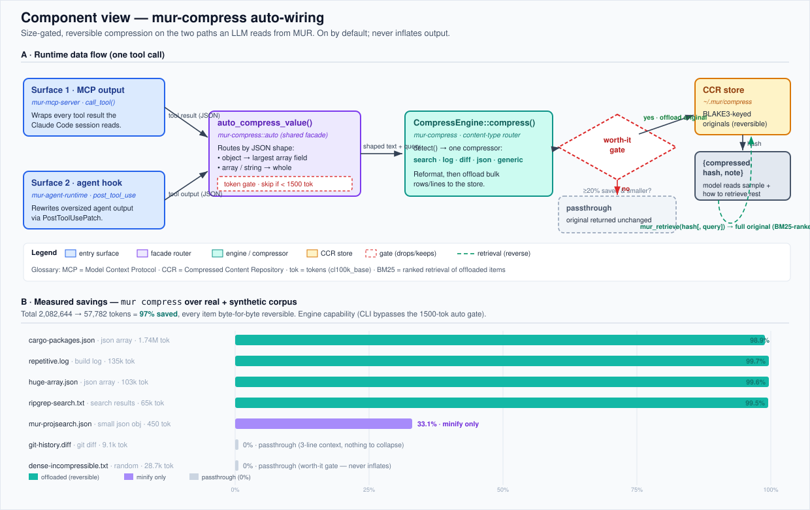

# mur-compress auto-wiring — architecture & use-vs-no-use report

**Date:** 2026-06-14 · **Branch:** `feat/compress-autowire`
**Spec:** [`docs/superpowers/specs/2026-06-14-mur-compress-autowire-design.md`](superpowers/specs/2026-06-14-mur-compress-autowire-design.md) ·
**Plan:** [`docs/superpowers/plans/2026-06-14-mur-compress-autowire.md`](superpowers/plans/2026-06-14-mur-compress-autowire.md)



## What this is

MUR already had a reversible, content-aware compression engine (`mur-compress`) exposed as manual MCP tools (`mur_compress`/`mur_retrieve`/`mur_compress_stats`). This change makes it fire **automatically and size-gated** on the two paths an LLM actually reads from MUR:

- **Surface 1 — MCP output** (`mur-mcp-server`): a wrapper at the `call_tool` boundary compresses large tool results before the Claude Code session reads them, and passes any `query` arg through so search results stay BM25-retrievable.
- **Surface 2 — agent runtime** (`mur-agent-runtime`): a `CompressHook` rewrites oversized tool outputs for MUR's own spawned agents via `PostToolUsePatch` (mirrors the existing `B0SafetyHook`).

Both call one shared facade, `mur_compress::auto_compress_value`, which routes by JSON shape. Two gates guarantee safety: a **token gate** (skip < `min_tokens`, default 1500) and the engine's **worth-it gate** (keep only if the result is smaller and clears `bloat_threshold`, default 20%). It is **on by default** and configured in `~/.mur/compress.yaml`.

## Use vs no-use comparison

Generated by [`scripts/compress-bench.sh`](../scripts/compress-bench.sh), driving the real `mur compress` CLI over a real + synthetic corpus from this repo. Every offloaded item was retrieved and checked **byte-for-byte against the original**.

| Corpus item | Content type | No-use (tokens) | With compression | Saved | Offloaded | Reversible |
|---|---|--:|--:|--:|:--:|:--:|
| cargo-packages.json | JSON array | 1,741,652 | 18,503 | **98.9%** | yes | ✅ |
| repetitive.log | build log | 135,000 | 445 | **99.7%** | yes | ✅ |
| huge-array.json | JSON array | 102,862 | 410 | **99.6%** | yes | ✅ |
| ripgrep-search.txt | search results | 64,883 | 326 | **99.5%** | yes | ✅ |
| mur-projsearch.json | small JSON object | 450 | 301 | 33.1% | no (minify) | ✅ |
| git-history.diff | git diff | 9,101 | 9,101 | 0.0% | no | ✅ |
| dense-incompressible.txt | random bytes | 28,696 | 28,696 | 0.0% | no | ✅ |
| **TOTAL** | | **2,082,644** | **57,782** | **97.2%** | | ✅ |

**~2,024,862 tokens saved** on a single read of this corpus (≈ $6 at an illustrative $3 / 1M tokens — and recurring on every read).

## Reading the results honestly

- **Where it wins big (98.9–99.7%):** redundant, structured bulk — JSON arrays, repetitive logs, ripgrep dumps. These offload the bulk to the CCR store and leave a small sample + a `hash`. This is the headroom-style case and the common shape of MCP tool output.
- **`mur-projsearch.json` (33.1%, no offload):** a small *object* (450 tok). The JSON compressor only collapses a **top-level array**, so an object is minified only. This is exactly why the surfaces don't stringify the whole object — `auto_compress_value` compresses the **largest array-valued field** so real `mur_project_search` results (`{"results":[…],"count":N}`) offload properly while scalar fields stay intact.
- **`git-history.diff` (0%, passthrough):** the diff compressor collapses unchanged-context runs **longer than 3 lines**, but `git log -p` emits 3-line context by default — nothing to collapse, so the worth-it gate passes it through unchanged. Diffs are the one content type that didn't compress on this repo.
- **`dense-incompressible.txt` (0%, passthrough):** random base64. The worth-it gate refuses to offload, proving the design **never inflates output** and never forces a pointless retrieval round-trip.

The two 0% rows are not failures — they are the safety gate working. "Use" is never worse than "no-use."

## Known limitation — Surface 2 end-to-end

`mur-agent-runtime/src/hooks/b0.rs` documents that the supervisor **does not yet consume `replace_output`**. So `CompressHook` produces a correct patch and is fully unit-tested at the hook level, but its end-to-end effect on what agents read depends on supervisor wiring that lands separately — the same status as B0's redaction (rule 8). **Surface 1 (MCP) has no such gap and is fully effective today.**

## Configuration

```yaml
# ~/.mur/compress.yaml
auto:
  enabled: true        # master switch
  min_tokens: 1500     # outputs smaller than this are never auto-compressed
  mcp: true            # Surface 1
  agent_runtime: true  # Surface 2
```

Set `enabled: false` for exact pre-change behavior (manual tools still work). The agent-facing guide ships as the `mur-compress` skill; see also [`mur-compress/README.md`](../mur-compress/README.md).

## Reproduce

```bash
cargo build -p mur-core
./scripts/compress-bench.sh          # writes target/compress-bench/results.json
```

## What shipped (commits on `feat/compress-autowire`)

1. `feat(compress)` — `auto` facade (`AutoCfg`, `auto_compress`, envelope)
2. `feat(compress)` — `auto_compress_value` shape router (object / array / string)
3. `feat(mcp)` — Surface 1 wrapper at `call_tool`
4. `feat(agent-runtime)` — `CompressHook` (Surface 2)
5. `docs(compress)` — `mur-compress` teaching skill + crate README
6. `test(compress)` — this bench harness

All units built with TDD; `cargo test` + `cargo clippy -- -D warnings` green per crate.
