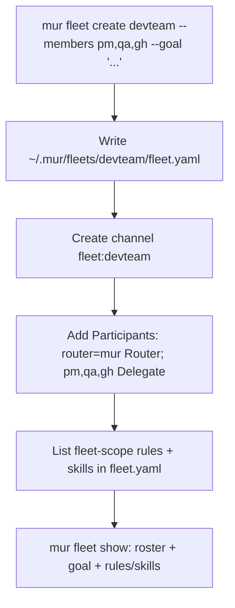
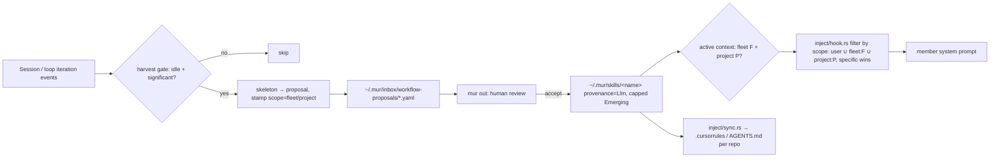

# MUR Fleet — Design Spec

- **Date:** 2026-06-19
- **Status:** Approved (design); ready for writing-plans
- **Author:** David Chang (with Claude Code, ultracode research)
- **Research basis:** Workflow `wf_ce1f3292-114` (6 codebase-mapping agents + 5 web-research agents on 2026 multi-agent teamwork / agent loops + synthesis).

## Thesis

A **fleet** is a named team of MUR agents working a shared goal, with its own rules + skills,
plus an optional continuous loop engine.

MUR already has every primitive a fleet needs. **A fleet is a thin object plus a YAML file,
not a subsystem.** Channels are the blackboard, `channel/delegate` is the supervisor edge,
skills are the rules/skills layer, the harvest pipeline is the learner, HITL is the gate,
the daemon is the loop driver, commander is the (later) cross-host governance plane.

The only genuinely new things are:

1. A `Fleet` struct + `~/.mur/fleets/<name>/fleet.yaml` (one file + one loader).
2. A `scope` field on `SkillManifest` (+ an injection filter).
3. A `fleet_tick` daemon loop (Phase 2) that **reuses the existing DAG executor**.

Everything else is wiring.

## Goals

- First-class `Fleet`: group N agents + a goal + a dedicated channel + scoped rules/skills.
- Per-fleet and per-project **rules** and **skills**, agent-generatable via the existing harvest gate.
- A **fleet loop** (sense → plan → assign → execute → review → learn) with hard out-of-agent guards.
- Reuse existing primitives (agents, channels, DAG executor, HITL, skills, harvest, daemon) — minimal new code.

## Non-goals (explicit YAGNI — do NOT build)

- Contract-net/bidding, swarm/stigmergy, leader election (research-tier; no user need).
- A new "rules" object distinct from skills (a rule **is** a skill with a tag).
- A fleet-specific A2A method or transport (`channel/delegate` + `message/send` cover it).
- A separate on-disk skill tree for fleets (one store, scope metadata).
- Manager-of-managers hierarchy (emerges free from nested delegation if ever needed).
- OpenTelemetry GenAI / KMS / transparency-log / post-quantum (later phase, if demand appears).
- Always-on loop without budget guards (the documented path to a runaway bill).

## Decisions (locked)

| ID | Decision |
|----|----------|
| **D0** | `team` = shareable **template/bundle** (definition); `fleet` = **running working group** (runtime instance). Best-practice "definition vs run" split (CrewAI Crew/kickoff, AutoGen GroupChat/run, LangGraph graph/thread). `mur fleet create --from-team <slug>` is an **optional** seed, not a prerequisite. Existing `mur team` (use/share/sync) is unchanged and orthogonal. |
| **D1** | Each iteration is planned by a **router agent named in `fleet.yaml`**; if omitted, the concierge `mur` is the router. Reuses `ParticipantRole::Router`. |
| **D2** | Loop trigger: **Phase 1 manual `mur fleet run`** (one iteration); **Phase 2 cron** via existing schedule. **Never** always-on without guards. |
| **D3** | Rule/skill scope uses **both** a `scope` field on `SkillManifest` (injection precedence) **and** `fleet.yaml` lists (portability — a fleet travels as one file + referenced skills). |
| A1 | Loop guards (iteration cap, budget, stuck-detection, deadline, kill) live in the **daemon tick — outside any agent**. Research is unanimous that stop-controls must be external to the model. |
| A2 | Phase 1 fleet membership is a **static list**. Capability-matched / dynamic membership deferred. |

### Naming note

`fleet_sync` (existing) is **device** entity-sync; it keeps its internal name but is surfaced to
users as "device sync". The top-level `mur fleet` noun means the agent working-group only — we do
not expose two "fleet" meanings to users.

## Data model

### `Fleet` (new struct in `mur-common`)

```yaml
# ~/.mur/fleets/<name>/fleet.yaml          ← the only new persistent object
name: devteam                  # canonical, lowercase, == directory slug
display_name: Dev Team         # uppercase brand-safe label
goal: "Keep the mur repo green: triage, fix, test, open PRs."
router: mur                    # optional; omit → concierge `mur`
members: [pm, qa, ghmanager]   # agent names (must resolve via canonicalize_agent_name)
from_team: mur-devteam         # optional provenance: team template this was seeded from
channel_id: "fleet:devteam"    # shared blackboard; auto-created on `create`
rules:  [fleet-pr-etiquette, repo-safety]      # skill names, scope=fleet
skills: [triage-issue, run-nextest, open-pr]   # skill names, scope=fleet
loop:                          # optional; Phase 2. Absent = manual single-run only.
  trigger: manual              # manual | cron:<expr>
  max_iterations: 8
  budget_usd: 5.0
  deadline: 2h                 # humantime duration
  done_when: "all assigned issues closed or escalated"
```

Loader/writer follow the project's atomic YAML pattern (temp file + rename, as in `store/yaml.rs`).
Name resolution for members reuses `a2a_dial::canonicalize_agent_name` (case-insensitive).

### `SkillManifest` scope (new fields)

`SkillManifest` lives at `mur-common/src/skill/manifest.rs:33-88`. Add three fields, all
`#[serde(default)]` for back-compat (existing skills load as `scope: User`):

```rust
scope: SkillScope,            // enum { User, Project, Fleet, Enterprise } — default User
fleet: Option<String>,        // selector when scope == Fleet
project: Option<String>,      // selector when scope == Project (repo path or id)
```

## Architecture & integration (capability reuse)

| Fleet need | Reused primitive | Location |
|---|---|---|
| Team-of-agents substrate | per-agent A2A runtime, `~/.mur/agents/<name>/` | `mur-common/src/agent.rs`; `mur-agent-runtime` |
| Shared memory / blackboard | signed append-only channel, per-actor verify-on-fold | `mur-common/src/channel.rs`; `mur-channel/src/{sign,store}.rs` |
| Supervisor → worker edge | `channel/delegate` (peer-writes-own) | `mur-agent-runtime/src/protocol/methods/channel_delegate.rs` |
| Plan execution (seq/parallel) | DAG executor (`execute_dag`, `DagExecOptions`, `emit_channel`, `build_channel_delegate_params`) | `mur-core/src/executor/dag.rs` |
| Risk-tiered HITL gate | SHA-256-pinned, fail-closed, signed `HitlResponse` | `mur-common/src/hitl.rs`; `mur-core/src/hitl/gate.rs` |
| Roles | `ParticipantRole{Owner,Router,Delegate,Observer}` | `mur-common/src/channel.rs` |
| Channel writes (signed) | `append` / `append_signed` | `mur-core/src/channel_writer.rs` |
| Loop driver | daemon 30s tick (`action_tick::scan_all_agents`) | `mur-daemon/src/main.rs:146-157` |
| Auto-generate skills (gated) | harvest: idle → gate → skeleton → proposal → `mur out` | `mur-core/src/harvest/{gate,proposal,skeleton}.rs` |
| Skill injection | `format_skills_for_injection`, `format_unified_injection_items` | `mur-core/src/inject/hook.rs:374,510` |
| Per-repo rule files | `.cursorrules` / `AGENTS.md` emission | `mur-core/src/inject/sync.rs` |
| Cross-host sync (later) | `fleet_sync` entity sync (AgentProfile/Skill/ModelBinding) | `mur-core/src/cmd/fleet_sync.rs` |
| Cross-network governance (later) | commander bridge, signal server, schedule claim | `mur-daemon/src/signal_server.rs`; `mur-common/src/schedule_claim.rs` |
| Command-shape template | `mur team` subcommands | `mur-core/src/cmd/team_cmd.rs` |

- **Channels/tasks:** a fleet === one long-lived channel `fleet:<name>`. Members are `Participant`s
  (router → `Router`, members → `Delegate`). Every loop step is an existing `EventKind`
  (`StateChange`, `Delegation`, `ToolCall/Result`, `Note`, `HitlRequest/Response`). **Zero new event types.**
- **Daemon:** add `fleet_tick::scan_all_fleets(&mur_home)` next to `action_tick` (same 30s cadence,
  same spawn pattern). The tick owns all loop guards.
- **mur server:** nothing required for Phase 1/2. Phase 3 reuses `fleet_sync` to replicate
  `fleet.yaml` + scoped skills across devices.
- **mur commander:** Phase 3 governance plane — fleet-wide budget ceilings + an un-overridable
  kill switch (a commander-signed `System` event written into the fleet channel via the existing
  signal server) + signed audit aggregation. No new commander surface before Phase 3.

## CLI surface

```
mur fleet create <name> [--members a,b,c] [--router <agent>] [--goal "..."] [--from-team <slug>]
mur fleet list
mur fleet show <name>
mur fleet run  <name>                 # Phase 1: one iteration; Phase 2: loop with guards
                 [--max-iterations N] [--budget-usd X] [--deadline DUR]
mur fleet stop <name>                 # Phase 2
```

Command module mirrors `cmd/team_cmd.rs` shape and is split per the ≤800-line rule
(e.g. `cmd/fleet/{create,list,show,run}.rs`).

## Fleet loop design (Phase 2)

Outer OODA loop lifted to a team, driven by `fleet_tick`, each phase executing with existing code:

```
SENSE   read fleet channel since last cursor → fold state
PLAN    router agent turn: goal + state → next DAG steps        (message/send to router)
ASSIGN  steps with delegate_to → members                        (DAG executor → channel/delegate)
EXECUTE members run turns, sign own results into channel         (peer-writes-own)
REVIEW  router folds results; mark step done / re-plan           (channel fold + StateChange)
LEARN   harvest gate scans the iteration → scoped skill proposals to inbox
```

### Guards (all in the tick, outside the model — non-negotiable)

- **Iteration cap** — `loop.max_iterations`; halt + summarize on exhaustion.
- **Budget ceiling** — cumulative USD/tokens per run, priced from local `~/.mur/models.yaml`; hard-stop on breach.
- **No-progress / stuck detector** — *highest-leverage guard.* Trip when the last N iterations produced
  no new `ToolResult{success=true}` and the same step set repeats (OpenHands-style: same action+result
  ≥4×, or router monologue ≥3×). Cheap — the channel already records every attributed event.
- **Time circuit-breaker** — absolute `loop.deadline`.
- **Semantic done** — `done_when`: a machine-checkable predicate or a router self-eval signed as
  `StateChange→Completed`. A loop with an unevaluable goal must not run (require an explicit done test).

### HITL + intervention ladder

Any member step with `risk: write`+ pauses the **whole loop** on the existing SHA-256-pinned gate;
approval via `mur channel approve <channel_id> <hitl_id>`. Before halting on trouble:
reflect (re-prompt router) → re-assign step to another member → graceful partial completion → human handoff.
**Kill switch** (Phase 3) = a commander-signed `System` event the tick checks each iteration and obeys un-overridably.

## Rules & skills layering

Three scopes, one store, precedence highest → lowest (mirrors Claude Code / Cursor ladders):

```
enterprise (commander, signed)  >  fleet  >  project  >  user / global
```

- **One field, not a new type.** When a member acts in `fleet:<name>`'s channel inside project `P`,
  injection selects `user ∪ fleet:<name> ∪ project:P` skills; **layers combine, specific wins** on conflict.
  Filter applied in `inject/hook.rs` skill-selection before `format_skills_for_injection`.
- **Storage:** all skills stay at `~/.mur/skills/<name>/skill.yaml`; scope is metadata. Fleet membership
  of rules/skills is *also* listed in `fleet.yaml` so a fleet is portable as one file + referenced skills.
- **Auto-generation:** reuse the harvest pipeline unchanged except **stamp `scope`/`fleet`/`project`**
  from the loop context at proposal time. Flow: iteration ends → `harvest::scan()` gates → `skeleton` →
  `proposal` to `~/.mur/inbox/workflow-proposals/*.yaml` (scope-stamped) → human reviews via `mur out` →
  on accept, skill lands in store with `provenance: Llm`, **capped at Emerging until curated**
  (`skill/lifecycle.rs:234`). Per-repo `.cursorrules` / `AGENTS.md` continue via `inject/sync.rs`.

## Phased plan (lazy-first)

**Phase 1 — Working fleet, single host, manual run (smallest end-to-end diff):**
1. `Fleet` struct + `~/.mur/fleets/<name>/fleet.yaml` loader/writer (`mur-common`).
2. CLI `mur fleet {create|list|show|run}` (mirror `team_cmd`); `create` writes YAML + creates the channel
   + adds participants; `run` does **one** iteration.
3. `run` = attach `fleet:<name>` channel → `message/send` goal+state to router → router returns DAG →
   `execute_dag` with that `channel_id` → print folded result. **All reused.**
4. `scope` enum + selectors on `SkillManifest` (+ injection filter). Default `User` (`#[serde(default)]`).
- *Skipped: loop, daemon tick, guards, commander, sync. Add when iteration-of-one proves out.*

**Phase 2 — The loop + guards:** `fleet_tick` in daemon (manual-triggered or cron). Iteration cap,
budget, channel-based stuck detector, deadline. HITL already wired through DAG steps. Harvest stamps scope.

**Phase 3 — Governance + cross-host:** commander-signed kill event (reuse signal server), fleet-wide
budget ceilings, `fleet_sync` replicates `fleet.yaml` + scoped skills.

**Phase 4 (only if demanded):** OTel GenAI emission, A2A Agent-Card discovery, capability-matched membership.

## Flow diagrams

### (a) Fleet creation


### (b) One fleet-loop iteration (Phase 2)
```mermaid
sequenceDiagram
  participant T as daemon fleet_tick (guards)
  participant CH as channel fleet:devteam
  participant R as router agent (mur)
  participant M as member agents
  participant H as HITL gate / human
  T->>T: check caps / $budget / deadline / stuck — trip → halt
  T->>CH: SENSE: load events since cursor
  T->>R: PLAN: goal + state → next DAG steps
  R-->>CH: StateChange(plan) [signed]
  T->>M: ASSIGN+EXECUTE via DAG (channel/delegate)
  M-->>H: step risk>=write? gate (SHA-256 pin)
  H-->>M: approve/deny [signed HitlResponse]
  M-->>CH: ToolResult / self-signed reply
  T->>R: REVIEW: fold results; done? re-plan?
  R-->>CH: StateChange(Completed) or loop
  T->>T: LEARN: harvest gate → scoped proposals → inbox
```

### (c) Rule/skill auto-generation + injection


## Load-bearing files (Phase 1)

- `mur-common/src/agent.rs`, `mur-common/src/channel.rs`, `mur-common/src/skill/manifest.rs`
- `mur-core/src/executor/dag.rs` (`execute_dag`, `DagExecOptions`, `build_channel_delegate_params`)
- `mur-core/src/channel_writer.rs` (`append` / `append_signed`)
- `mur-core/src/inject/hook.rs` (`format_skills_for_injection`, `format_unified_injection_items`)
- `mur-core/src/cmd/team_cmd.rs` (command-shape template)
- `mur-daemon/src/main.rs:146-157` (tick pattern, Phase 2)

## Testing strategy

- **Phase 1:** `Fleet` YAML round-trip unit test; `scope` serde default/back-compat test; injection
  filter unit test (user ∪ fleet ∪ project precedence); `fleet run` integration test driving one
  iteration over a channel with an echo/stub router. (CI uses `cargo nextest`.)
- **Phase 2:** guard unit tests (iteration cap, budget breach, stuck-detector trip, deadline);
  loop resume from channel cursor after a simulated crash.
- Run via Harness: implement → test → log → monitor → fix, with resume across sessions.

## Resume

Long-running implementation uses the Harness pattern with a tracked task list and this spec as the
durable contract. Each phase is independently shippable; the workflow that produced this brief is
resumable via `{scriptPath, resumeFromRunId: "wf_ce1f3292-114"}`.
