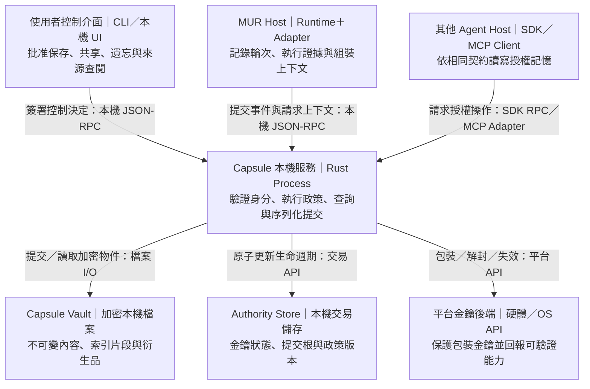

# Capsule：獨立 Agent 記憶核心與開放協定

> Date: 2026-09-22
>
> Status: 架構評審基線有條件通過；僅批准 G0 可實現性驗證，G1／G2 未批准；沒有平台已獲 Strict 認證
>
> Scope: 獨立專案的系統設計、信任邊界、記憶語義、MUR 接入及驗收
>
> Working name: Capsule；正式產品名稱不在本次裁決範圍

## 0. 已確認的方向與文件地位

使用者已確認：

1. 這是獨立於 MUR 的 Agent 記憶專案，MUR 是第一個完整接入者。
2. 本機優先，服務不同 Agent runtime，支援受控共享；企業多租戶與跨裝置同步不作為第一版前提。
3. 保留隱私、遺忘、來源追溯的核心目標；允許提出原先凍結條款的明確修訂案。
4. 工作區授權後可自動記錄與整理。自動產生的摘要、推論須持續繼承來源的權限與遺忘約束。
5. 脫離來源獨立保存、擴大共享範圍須明示授權。
6. 提供 Strict／Managed 兩種儲存模式，由使用者明示選擇。Managed 不宣稱 L2；Strict 僅在後端通過防回滾銷毀驗收時提供 L2，無法滿足時不得自動降級。

本文件已獲有條件通過，作為架構評審基線；批准範圍僅限 G0。B1–B8 阻塞項尚未解除，R4–R10 不因本次回修而自動升格為已批准機制。下文 MUST 表示「採納本提案後必須滿足的契約」。原始文件保留不動，§13 列出需要回修的條款，批准後才同步變更。

本次審核的候選解法集中於 [G0 契約](2026-09-22-capsule-g0-contracts.md)，可執行驗收與證據要求見 [G0 驗收計畫](../plans/2026-09-22-capsule-g0-validation-plan.md)。兩者是待驗證設計，不能代替密碼學與平台實測。

輸入文件：

- [Capsule 記憶第一層架構](2026-09-22-capsule-memory-architecture-design.md)：生命週期與遺忘的起點。
- [MUR Agent 對話記憶](2026-09-22-agent-conversation-memory-design.md)：工作集、對話分支與執行證據需求的起點。
- [Memory Federation](2026-08-04-unified-memory-federation.md)：MUR 的身份、scope、單寫者與 notes 提案邊界。
- [Turn Ledger](2026-09-19-turn-ledger-memory-design.md)：執行證據不可被模型敘述取代。

## 1. 產品主張與領導性來源

**Capsule 讓 Agent 累積可追溯、可修正、受授權控制的記憶，並將這些記憶編排成當前任務能使用的上下文。**

使用者應得到四個具體結果：

- 換模型、換 Agent 後，授權範圍內的工作仍能延續。
- 能查看一項結論的來源、適用時間、矛盾與驗證狀態。
- 自動學到的內容不會因摘要、索引或轉存而逃離原始限制。
- 查不到、只查到部分、來源已失效與從未取得證據，會得到不同的回答。

分層記憶、反思與事實／信念區分已有研究先例。Hindsight 已提出事實、經驗、實體摘要與信念的區分；MindMemOS 探討記憶結構與技能的演化。本設計不以這些概念本身宣稱新穎，也不引用不同評測設定的分數宣稱領先。[Hindsight](https://arxiv.org/abs/2512.12818)、[MindMemOS](https://arxiv.org/abs/2608.12428)

本專案的差異化假說是：**把自主整理、受來源約束的衍生生命週期、跨 runtime 契約與可檢驗的上下文組裝，同時做成可靠的本機基礎設施。** 這是待 §14 評測的產品假說。

## 2. 路線比較與推薦

| 路線 | 長處 | 代價 | 決定 |
|---|---|---|---|
| 僅提供嵌入式函式庫 | 部署小、呼叫便宜、適合可信 host | 多個不互信 Agent 難以共用同一授權邊界；各 host 易有不同保存行為 | 保留為可信單一 host 模式 |
| **獨立核心＋本機授權服務＋Adapter** | 一套生命週期契約；多 runtime 的授權與提交有共同執行點 | 需要本機 IPC 與服務管理 | **主要架構** |
| 中央雲端記憶服務 | 適合企業管理、遠端共享 | 網路、租戶與服務營運變成第一版前提 | 延後，由協定保留擴充空間 |

核心以獨立 Rust workspace 交付，不依賴 `mur-*` crates；MUR Adapter 位於 MUR 一側。第一階段交付核心、本機服務、CLI、版本化協定與 MUR Adapter。Python／TypeScript client 由同一 schema 衍生，後續以相同 conformance suite 驗證，避免維護多套語義。

本機服務可隨用啟動。**服務正在執行是請求可用性的條件，服務永久在線不是資料正確性或恢復的條件。** 服務停止時不允許 Agent 改走檔案直讀或持有的 DEK；重啟從已提交狀態恢復。

## 3. 信任邊界與部署

### 3.1 容器視圖：單一裝置上的 Capsule 與 Agent

以下全部是提案中的部署容器／外部系統；不代表現況已實作。



圖例：矩形代表部署容器或外部系統，實線箭頭代表由呼叫方發起的操作；省略回應箭頭。IPC＝行程間通訊；SDK＝客戶端函式庫；MCP＝Model Context Protocol。macOS／Linux 的本機傳輸以 Unix domain socket 為首個實作；其他平台的傳輸不改變協定語義。

### 3.2 可信與不可信的範圍

- Capsule 核心、授權服務、平台金鑰後端及 host 的 capture／exposure Adapter 屬於可信計算邊界。
- 模型輸出、召回內容、工具回傳文字、第三方文件均為不可信資料；不能授予權限。
- `principal`、`workspace`、`agent` 與允許的動作由已驗證連線及授權決定，不接受模型提供的字串冒充。
- Agent 可用的工具不包含自行核准共享、降低政策或獨立保存的管理權限。
- 同一 OS UID 或持有 socket 路徑不等於通過 Agent 身分驗證。

不同信任域的 Agent 必須由 OS 隔離或可驗證的 host sandbox 阻擋直接讀取 Authority、其他 Agent 憑證、broker 記憶體與儲存明文。做不到時，部署回報 `isolation=trusted_host_only`，不能宣稱抵禦同使用者下的惡意任意程式。一般嵌入模式只適用於同一信任域。

第一版威脅模型包含損毀檔案、崩潰、過期權限、惡意模型輸出與未授權 Agent 請求；不承諾抹除已送到外部模型、使用者匯出、截圖或遭攻陷 OS 取得的明文。

### 3.3 本機儲存與模型資料外送分開控制

`egress_policy` 獨立於儲存政策。新工作區預設 `local_only`；使用者可明示授權指定 remote provider 及用途。Embedding、背景摘要與反思同樣受此政策控制。

MUR 接入時不能只因既有模型設定指向雲端，就默認獲准傳送所有歷史記憶。接入設定一次說明並取得範圍授權；未授權時省略受限記憶或選用本機處理器。外送紀錄不宣稱可以撤回供應者已看見的明文。

### 3.4 部署拒絕條件

不同 runtime 不代表彼此可不信任。同 UID、無 OS 邊界的部署只提供 `trusted_host_only`；若要求隔離不互信 Agent，回 `UnsupportedIsolation`。具體部署、能力回報與測試矩陣見 G0 契約 §8；Strict 儲存保證不能取代 runtime 隔離。

## 4. 核心詞彙與物件

| 名詞 | 定義 |
|---|---|
| Capsule | 不可變、以密文內容定址的持久物件；有自己的刪除單元與加密內容。 |
| Vault | 第一版的本機儲存與 Authority 交易域；內部再依 user／workspace／agent scope 授權。 |
| Observation | 可信 capture 邊界記錄的觀察，如使用者輸入或執行結果；只證明記錄到了什麼。 |
| Claim | 從觀察推得的敘述，帶來源、適用時間與認知狀態；不得默認為真。 |
| Episode | 同一工作脈絡內的一組事件與分支關係；不是實體大檔，也不是金鑰單元。 |
| Projection | 可重建的衍生 capsule，如摘要、claim、索引增補或工作集檢查點；持續綁定來源。 |
| View | 產生它的 process 內的暫態觀察；不自動恢復、不等同 Projection。 |
| Context Pack | 為一次任務組裝的 View，含選定證據、衝突與涵蓋狀態。 |
| Materialize | 明示批准，把仍合法可保存的 View 形成獨立 capsule；原有來源 provenance 保留。 |
| Exposure Receipt | 可信 Adapter 記錄一次模型呼叫實際接收了哪些受管記憶；不是模型自述引用。 |
| Grant | 限定對象、動作與範圍的授權；不是 Capsule 或內容。 |
| KA | Key Authority，負責金鑰可用性與銷毀；不負責判斷 Claim 真偽。 |
| Authority Store | KA、提交目錄與政策版本的持久交易邊界；沒有全文或全域語義索引。 |

「已記錄」「已推論」「已驗證」「已批准成為指令」是不同狀態。簽章只證明誰提供了記錄與記錄是否被改動，不能證明內容屬實。

### 4.1 事件與結論分離

邏輯物件包含：`event_id`、`episode_id`、`branch_parent`、`recorded_at`、事件種類、受保護 scope、來源及 payload。事件種類至少區分使用者陳述、assistant 敘述、工具執行結果、使用者修正與衍生輸出。

Claim 另外包含：`statement`、`supporting_refs`、`valid_from/valid_to`、`epistemic_status`、`contradicts/supersedes`。適用時間未知就保持未知，不拿記錄時間冒充事件發生時間。模型信心不能冒充經校準的機率。

修正透過新物件表達，不修改歷史。一般 reference 邊與「解密必須依賴的來源」有不同型別；提到某個 opaque ID 不必然依賴其明文，但凡真的使用過受管內容就必須納入 exposure 追蹤。

### 4.2 寫入與刪除的粒度

一段對話可以包含多顆 capsule；長時間 Agent process 不形成一顆無限增長的 capsule。一次 `CommitBatch` 可原子提交數顆各自單寫的 capsule，讓新使用者輸入、受來源約束的回答及工作集更新分別表達依賴。

同顆 capsule 的內容必須具有相容的存取政策、保存期限與依賴集合。不要把整個專案綁成一把金鑰，也不要把每個字拆成一顆。初始單元為單筆觀察或同一輪內同依賴集合的事件組；大小限制由量測調整。

內容位址計算於版本化 canonical envelope 與密文，不公開明文 hash；位址自身不參與自己的 hash。事件業務 ID 與密文內容位址分開，重新加密不冒充新的使用者事件。

第一版一次持久操作的所有來源必須位於同一 vault／Authority 交易域；共享的 Agent 在該域內取得適當 grant。跨 vault 的持久依賴回 `UnsupportedCrossVaultDependency`，不以局部鎖冒充跨域原子性。Context Compiler 請求也明確指定 vault；跨裝置／跨域合成留待另案。

## 5. 兩種持久化權利

| 操作 | 授權 | 來源被 L2 後 | 典型用途 |
|---|---|---|---|
| `capture` | 工作區 capture policy | 自身金鑰控制其可讀性；衍生輸入仍須帶依賴 | 記錄新輸入、工具證據 |
| `derive` | 工作區明示啟用的自動整理政策 | 任一必要來源失效，衍生物不能再次解密 | 摘要、反思、索引增補、檢查點 |
| `materialize` | 對具體內容與 scope 的獨立保存批准 | 若已先成功提交，原來源日後 L2 不刪除此獨立副本 | 使用者選擇留下的結論 |
| `grant` | 對象、動作、範圍的明示授權 | 不複製內容；新讀取仍查來源與權限 | 將受管記憶開放給另一 Agent |

自動 `derive` **不等於**自動 `materialize`。兩者都需在提交時重新驗證來源，前者繼承依賴，後者需要額外批准才能解除後續生命週期依賴。原來的三種 provenance declaration mode 保留；自動衍生用 `mandatory_tracked`，不新增第四態。

獨立保存批准綁定 `view_digest + sources + target_scope + action + expiry + nonce`。內容、來源或目的 scope 改變即失效；Agent 不能自行重用批准擴張內容。共享可批准具體範圍與對象，範圍內後續讀取不必逐次詢問。

### 5.1 防止透過下一輪回答洗掉來源

**用模型引用列表作 provenance 不足以防止洗白。** Adapter 必須追蹤送進模型的 Context Pack、歷史回答、工具回傳與每次追加召回，形成實際 exposure 集合。

- assistant 產生的文字、摘要與推論默認依賴該次推理的全部受管 exposure；模型不能自行刪減此集合。
- 已依賴來源的回答在下一輪作為 context 時，依賴繼續存在；不能重新標成「原始 observation」。
- 工具回傳若來自受管記憶，或工具參數承載受管內容，Adapter 傳遞相應 lineage；一般文字工具不能靠改名洗掉資料來源。
- 新使用者原始輸入可作獨立觀察；無法判定使用者是否從外部重新貼入已刪資料，不承諾全世界的資訊流追蹤。
- Adapter 無法涵蓋的外部內容標 `provenance_coverage=partial`；它不取得「所有來源均完整追蹤」的認證。
- 有記憶暴露後的寫入 MUST 帶可信 exposure token；不受整合的 MCP client 只能使用受限功能，不能自稱可安全自動回存任意模型回答。

保守追蹤的代價是依賴集合可能偏大。改善方式是讓抽取與整理工作只讀必要的最小輸入，將不同來源的結論分開產生；不能要求模型聲稱「沒有用到」某來源來解除限制。

### 5.2 可理解的例子

使用者授權工作區記憶後，A 記下「部署目標原為 X」，B 自動摘要引用 A。刪除 A 後，新的讀取不能解開 B。若 C 依賴 B，即使 C 沒直接列 A，也不能繞過這條鏈。

若使用者在刪除 A **之前**明示將 B 的某項內容獨立保存成 D，D 可繼續存在，且 D 的 provenance 說明其來處。若刪除先完成，舊 process 雖還看得到 B，新的獨立保存必須失敗。

### 5.3 Exposure token 與 Adapter 信任鏈

G0 契約 §5 定義 broker 簽發、Ed25519 簽章、instance／推理分支綁定、單調時鐘期限、nonce 與 RAM replay registry。可信 Adapter 須先完成 OS 身份綁定與 conformance；一般 MCP client 不自動取得可信 lineage 寫入資格。工具回傳、多輪證據與最終輸出以累積來源集合及最後一次 seal 綁定，E01–E18 是必要向量。

### 5.4 Materialize 的精確批准對象

G0 契約 §6 定義 broker 接收精確輸出 bytes 後新建的 RAM View，以及 deterministic CBOR 的 `view_digest`。批准綁定 broker incarnation、View ID、內容、來源、scope、動作、期限及 nonce。相同內容重新推導仍是新 View。broker 崩潰會使未提交 View／批准失效；已提交者只可冪等回 receipt。來源失效與提交競爭由同一 anchor 提交序列判定，不能憑批准保留解密特權。

## 6. 加密、金鑰與可誠實交付的遺忘

### 6.0 L2 與 Strict／Managed 狀態機

G0 契約 §2–§3 將 slot、有效可讀性、交易與 vault health 分為四個狀態維度，列出 I01–I10 與 C00–C14（含 C05a／C05b）共 16 個 crash cut。Strict 以不可回滾 anchor 選定已持久化 manifest；終態撤除與 root 選擇必須是同一後端原子動作。缺少當前 root 或硬體身份不符時進入 `Quarantined`，不能回讀舊 snapshot。

此後端能力尚待證明。Managed 使用磁碟提交，恢復舊備份可能恢復可讀能力，因此不稱 L2。Strict 無可用合格後端時回 `UnsupportedGuarantee`，禁止隱性降級。G0 的 Rust 抽象模型僅假設上述 anchor 性質。

依賴 envelope 的欄位、AAD、guard／DEK 分工、DAG 上限與記憶體契約見 G0 契約 §4；仍須密碼學評審，概念圖不構成安全證明。

### 6.1 解密依賴需要成立到金鑰結構

每顆 capsule 有隨機 payload DEK 與自己的 KA key slot。概念性的包裝結構如下，實際編碼、演算法參數與 nonce 規則須通過 §14 的密碼學評審才能定稿：

```text
原始／已批准獨立 capsule：
    slot guard → 解開 payload DEK → 解開內容

來源綁定 capsule C：
    C 的 slot guard + 可合法取得的各直接來源 DEK
        → 逐層解開 C 的 DEK envelope → 解開 C 的內容
```

這保留 nested AEAD 的全來源依賴目標，並補上不可省略的限制：**KA 不得另存一條只靠 C 自身 slot 就能取得 C 明文 DEK 的旁路。** Slot guard 與 payload DEK 分清用途，不直接把相同秘密跨域重用。

來源本身若是 Projection，取得它的 DEK 也要通過它的依賴包裝；因此 depth-1 provenance 不等於只查一層存活。所有普通衍生品，包括單一來源，都適用依賴約束。

Envelope 必須認證格式版本、來源集合、順序、key identity 與 payload binding，拒絕移除來源、重排或移植密文。使用經評審的 AEAD、KDF 與包裝實作，不自行發明密碼原語。此處定義安全性質，不把尚未評審的組合宣稱為已證明安全。

原始 DEK 不交給 Agent client。可信服務的操作快取須有界、短生命週期並盡力清除；每次新的讀取／提交都重新查授權與 KA。快取不能成為永久 key escrow。

### 6.2 金鑰銷毀與回滾是不同問題

`DELETE` 一筆 key row 不能單獨證明不可逆銷毀：舊資料庫頁、WAL、snapshot 或仍可用的 wrapping root 都可能保留解密途徑。只把資料庫加密也不能解決舊快照復活。

平台後端 MUST 分別回報並經測試驗證：`device_bound`、`non_exportable_root`、`rollback_resistant_erasure`、`isolation`。TPM、Secure Enclave、OS key store 不能只依名稱視為等價。Apple 的 Secure Enclave 文件描述特定非匯出私鑰與支援操作；這不足以推出任意應用資料庫具備防回滾銷毀。TPM 規格的 NV counter 能力也仍需正確的應用交易協定。[Apple Secure Enclave](https://developer.apple.com/documentation/security/protecting-keys-with-the-secure-enclave)、[TPM 2.0 Architecture](https://trustedcomputinggroup.org/wp-content/uploads/TPM-2.0-1.83-Part-1-Architecture.pdf)

使用者於 2026-09-22 確認提供兩個明確的儲存 profile：

- **Strict**：僅在後端通過防回滾與 key destruction 驗收時提供 `L2`；無 escrow、無一般備份金鑰復原。硬體不支援就回 `UnsupportedGuarantee`，不能自動降低保證。
- **Managed**：提供本機加密、依賴控制與正常服務路徑的刪除，明示不抵禦舊 Authority 快照回復。操作名為 `managed_erase`，不能回覆「L2 已完成」。必須由使用者選擇，不能是 Strict 失敗後的隱性 fallback。

以上雙模式及禁止隱性降級是已確認的產品裁決，不代表任何現有平台後端已通過 Strict。首個實作關卡先驗證選定裝置與可公開使用的 API；若無法達成，就保留限制，或另提改動威脅模型的裁決。

Vault 的 profile 在建立時選定並記錄，第一版不原地混用或降低。切換 profile 需走明示遷移與驗證；新儲存保護不能回溯升級 legacy 來源或弱證明的歷史可信度。

### 6.3 遺忘與已觀察內容

L2 的線性化點是 G0 契約定義的 `advance_epoch`：後端不可逆撤除舊 epoch 解密能力，同時選定包含銷毀終態的 durable manifest。這是待驗證的後端原子契約，不是 SQLite commit 與硬體撤除兩個分離時點。它與新讀取、衍生及 materialize 的驗證／提交有可解釋的先後順序。不能先回成功再等待背景工作真正撤除金鑰。

L2 不掃描全部衍生品，不列出應先保存的內容，不提供 undo、不要求跨 process 廣播。已交付的 View 可以留到原 process 丟棄它；新的服務請求與持久操作不能用它復活來源。

精確 `key_id` 的 KA 狀態可永久回答 `Destroyed`；自然語言「某內容以前是否存在」需要可用的語義證據，沒有足夠歷史不能宣稱從未存在。120 天審計窗口與永久 tombstone 不混為同一種查詢能力。

## 7. 提交、並行與恢復

### 7.1 寫端解耦，最後提交序列化

各 Agent 可並行準備輸入、產生索引及執行推理；每個 vault 的最後提交由持有排他 writer lock 的服務序列化。昂貴 LLM／embedding 工作不持有 KA 鎖。失去 writer 所有權的實例不能繼續提交；多機共同掛載同一 vault 不在第一版支援範圍。

提交流程：

1. 驗證連線 scope、寫入政策、idempotency key 與 exposure token。
2. 產生新 key identity，準備加密物件；寫入 staging，fsync，再移到不可變位置並 fsync 目錄。staging 不儲存未加密的 view 恢復資料。
3. 持有提交序列化權，重新驗證完整來源依賴與政策；先持久化包含 key entries、出生記錄、批准消耗及 receipt 的完整候選 manifest，再以後端原子 anchor 選定它。只有被 anchor 選中的物件可被授權讀端發現。
4. 回傳 `commit_id`；清理已失效的 staging。磁碟上有 blob 不代表 capsule 已出生。

來源在推理期間失效：丟棄衍生提交，不降級成獨立 capsule。驗證與公開提交之間必須排除相關 L2／撤權；硬體後端以自己的 prepare／commit／recovery 協定接合 Authority 交易，不能假設一次 SQLite commit 等於硬體原子操作。

必要內部操作日誌可有 `prepared` 狀態，但對外 lifecycle 仍收斂為 Live、Destroyed 或未提交。硬體先前進而本機提交未完成時，只能補完已準備的合法終態或 fail closed，不能倒退硬體 epoch。後端未通過各 crash point 測試前不能標 Strict。

### 7.2 冪等與 read-your-writes

同一經驗證 principal 下，`operation_id + canonical input digest` 相同就回原結果；同 ID 異內容回 `IdempotencyConflict`。永久語義 id 使用出生／終態記錄承載必要去重，快取可重建，不新增無限期 query history。

Input digest 與具語義的 receipt 內容留在受保護區，不把明文內容 hash 加進永久公開記錄。操作所指內容已遺忘時，重試回終態而不再次 capture；最小出生／終態關聯可保留 opaque operation ID，但不保留原始 payload 供重新比較。

內部提交水位屬於本 vault；對外 `commit_id` 是綁定 principal／scope 的不透明 token，不揭露 vault 全域計數或更新頻率，也不是時間戳或可排序 UUID。`recall/compile_context(min_commit=...)` 必須先包含該水位的授權資料；若預算內做不到，回 `FreshnessUnavailable`，不把 stale 結果當成履約。

沒有指定 `min_commit` 時，可依請求允許的 freshness 回傳 partial/stale。新 capsule 隨寫入已有詞法索引，因此 vector 處理未就緒不阻擋基本 read-your-writes。

### 7.3 權威與衍生狀態

Authority Store 保存必要的 key state、opaque 提交根、當前政策版本與撤權狀態；政策內容採受保護的版本化物件。這是原「KA 唯一永久可變元件」的明示修訂，授權狀態不混入 key 管理程式的業務職責。

出生／終態記錄保持最小，不能放名稱、摘要、主題或模型輸出。policy 管理 metadata 的存在與更新頻率可能可觀察，須列為 metadata leakage；不得因此開放查未授權內容是否存在。

### 7.4 跨 Authority／key backend 恢復協定

G0 契約 §3 定義 prepare、durable manifest、anchor CAS、pointer 修復與 receipt 的順序。anchor 前的 orphan 不可見；anchor 後回應遺失可回原 receipt；缺少 manifest 時隔離。候選全量 epoch 重封裝成本為 O(live slots)，必須一併通過硬體與效能驗收，不能假設現有硬體能原子承接此契約。

## 8. 檢索與上下文編排

### 8.0 Discovery API 與 metadata 洩漏

G0 契約 §7 定義 `discover(scope_handle, page_size, cursor)` 與受保護的授權出生目錄。先驗證 scope，再列舉 opaque references；未授權、未知與已消失的識別碼對未授權者統一回 `Unavailable`。不提供全域數量或全域提交水位。

授權者可逐頁推知自己可見的物件數量與變化；磁碟觀察者仍可能看到大小、時序與 envelope 的來源識別關係。這些暴露列入 metadata review，不宣稱存在性對實體儲存觀察者隱藏，也不宣稱 ORAM 或常數時間。

### 8.1 加密片段與可重建讀端

每顆 capsule 在提交時包含必要的詞法與結構索引。Embedding 若尚未取得，不阻擋原始提交；稍後形成新的 source-bound Index Projection，不能原地補寫舊 capsule。

首次查詢先在授權 vault／scope 內發現物件，再按候選片段解開索引；只有獲准資料可進入排名。語義標籤與 embedding 也屬受保護內容，不放明文 header。主題／實體／時間索引是片段內能力，不是永久全域真相。

讀端可在受信任 process 建立可丟棄的合併索引與候選快取；每次發出新的結果前重新核對其依賴與權限。LanceDB、Tantivy、FTS5 是可選執行後端，必須證明不把明文 spill、temp、WAL 或索引快取留在未受管儲存。未符合時不用該模式。

拒絕全域持久語義索引會增加冷啟動與發現成本。初版明確量測片段數量、解密次數與 cold/warm latency，允許有界 partial 查詢；不能宣稱已達百萬 capsule 的次線性全庫檢索。

若後續需要批次 Index Projection，每個持久 segment 必須依賴全部包含的來源；刪除其中之一可使該 segment 整體不可讀，之後由存活原始 capsule 重建。這是可接受的可用性代價，不靠一把獨立全域 index key 繞過遺忘。

### 8.2 Query Planner 與 Context Compiler

邏輯流程固定為：

1. 驗證 principal、scope、egress 與操作能力。
2. 理解查詢的實體、時間、任務與所需證據類型。
3. 在授權來源內做 lexical／vector／結構候選檢索。
4. 合併候選、解析時間衝突、排除已失效來源；有限預算內無法完成的部分明示。
5. 依 token 預算打包現行任務、未了事項、決策、必要證據及最近完整輪次。
6. 產生 Context Pack 與 exposure receipt，交由 Adapter 轉成 provider 接受的訊息格式。

不能把 cosine 或 rank fusion 分數稱為「真實可信度」。檢索品質、來源權威、時效及執行驗證分開表達；重要性不能直接覆蓋使用者較新的修正。

Context Pack 的最低契約：

```text
ContextPack {
  pack_id, vault_id, commit_watermark, policy_revision,
  items[{content, source_refs, evidence_kind, valid_time, epistemic_status}],
  conflicts[], open_questions[],
  coverage{complete_for_requested_scope, omissions, stale, budget_limited},
  token_usage{budget, estimated, estimator_version},
  exposure_token
}
```

`complete_for_requested_scope` 僅指契約指定的授權資料／水位被完整處理，不能表述為掌握世界全部事實。未授權資料不出現在 omissions，也不洩漏數量。`NoEvidence`、`PartialEvidence`、`ConflictingEvidence` 與後端失敗分開。

Pack 是資料，不是指令。原始引用必須定界，來源角色由 runtime 設定。只有另經批准的 policy／skill 能影響行為權限；反思結果不能自行變成 system instruction。

RPC 傳遞的是經授權的 evidence payload；接收 Adapter 在自己的 process 建立新的 View，不共享 broker 的物件或 `H(V)` 身分。`pack_id` 識別一次交付，不能解析回已消失的 View。Exposure token 綁定可信 host instance、推理呼叫與有效期限；host 重啟不能用舊 token 恢復未保存 View。若 Adapter 已將精確 bytes 登錄為 broker 自己的新生 RAM View，host 崩潰不會自動摧毀 broker 的 View；舊 host token 仍不可用於新 instance。broker 重啟後未提交 View 不可兌現。需要跨 broker 重啟延續的工作集必須先合法提交成 source-bound Projection，再重新授權讀取。

查詢與 exposure 的診斷紀錄採有界保留，最多沿用 120 天窗口；其中涉及內容與語義的欄位仍受來源金鑰約束。不得為了診斷永久保存 Pack 全文或建立 `H(V) → materialization` 查找表。

Token 預算依完整 outgoing request 計算：系統提示、工具 schema、現在訊息、保留回答空間與所有記憶一起算。Provider 回報校準只用語義相符的完整 token 計數；不可把部分 cache miss 計數當整個 prompt。50/85% 等舊數字是可調起點，不是所有模型的固定定律。

### 8.3 自主整理與演化

背景任務只在授權政策及 CPU／token／金額配額內執行，優先序為：確定性整理 → 衝突偵測 → 小範圍摘要／claim 抽取 → 有需求的反思。

每個任務記錄 transform version、輸入 capsule、實際 exposure 與資源使用。LLM 失敗可回退為確定性抽取，不創造沒有證據的 decisions；工具成功／失敗統計由 runtime 計算，LLM 不能修改。

記憶策略演化只可提出新的抽取 schema、排名設定或技能候選。先在固定 replay／holdout 上比較品質與成本，再批准部署版本；不能在自動演化時改變授權、遺忘、來源追蹤或資料外送規則。第一版不訓練使用者資料進模型權重。

## 9. 開放協定與擴充契約

協定以版本化 schema 定義，和 Rust 內部型別分離；本機 JSON-RPC 是首個 transport。MCP 提供模型可用工具子集，不能替代 host capture／exposure 整合。

| 操作 | 語義 | 一般 Agent 是否可用 |
|---|---|---|
| `capabilities` | 查 protocol、profile、硬體保證、格式與 feature support | 是 |
| `capture_batch` | 以可信事件與冪等鍵提交新觀察／受管輸出 | Host Adapter |
| `recall` | 回傳有來源與 coverage 的候選 | 是，受 scope 限制 |
| `compile_context` | 按任務與預算產生 Pack | Host Adapter／授權 client |
| `derive` | 保存仍綁來源的 Projection | 授權背景 worker／Host |
| `explain` | 在授權範圍追溯直接來源、有效性與推導版本 | 是 |
| `materialize` | 執行有明示批准的獨立保存 | 控制平面批准後 |
| `grant/revoke` | 改變對象、scope、動作權限 | 控制平面 |
| `forget` | 按明示指定 profile 執行 L2 或 managed erase | 控制平面 |

每個回應帶 protocol version、request ID、capability/profile 資訊與具體 outcome。控制操作的批准由可信使用者介面產生，不能由 Agent 填 `approved=true`。

跨 Agent 預設共享同一份受管資料的存取權，避免複製一份自主生命週期的全文。共享衍生品仍要求接收者有權存取必要來源；只 grant 衍生品而未 grant 所需來源，讀取必須拒絕。若要另存可獨立分享的節選，走有明示批准的 materialize。

原始對話預設 Agent-private；共享以使用者選定的內容／範圍為準，不把同專案或同 fleet 自動等同可以讀所有歷史。撤權約束新的讀取，不承諾抹除已交付 View。

向後相容遵守 major version 與 feature negotiation。舊 client 不認識安全必要欄位時拒絕相關操作，不丟掉欄位後繼續。SDK 的成功回覆不等於內容已持久化，必須有 commit receipt。

## 10. MUR 無縫接軌

### 10.1 接入點與依賴方向

MUR → Adapter → Capsule 公開協定。Capsule 不反向載入 `mur-common`、MUR identity 類型或 `~/.mur` 配置。Adapter 負責將經驗證的 MUR 身分映射到 Capsule principal。

| 現有／原規格介面 | Capsule 模式的行為 |
|---|---|
| `TaskRunner::remember_turn` | 轉換 user／assistant／TurnLedger，連同 exposure 分別形成適當依賴的 CommitBatch |
| `seed_history`／`ConversationStore::prior` | 依 branch parent 與 task budget 呼叫 Context Compiler |
| 一輪一 frame、父指標 | 保留邏輯分支 ID；實體保存交給 capsule，不再雙寫完整歷史 JSON |
| `ConversationState`／fold sidecar | 轉成 source-bound Projection；提交成功後才換工作集指標 |
| `recall_conversation` | 保留 MUR 可見的基本參數；由 Adapter 派生身份與 scope，映射 coverage／錯誤 |
| `mur chat ask` | 用授權查詢橋接 Capsule；不把 Capsule 全文再 ingest 到中央 plaintext index |
| notes／`remember` | 保留 MUR notes 成熟度與提案流程；受來源約束的候選用受管 reference，獨立匯出另需批准 |

最低侵入點已對照本庫 `mur-agent-runtime/src/task_runner.rs` 的 `prior`、`seed_history`、`remember_turn` 與 `with_conversation_memory`。TurnLedger 必須保留 `narrative_only`、附件數、執行結果與失敗訊息；摘要不把 assistant 自稱成功轉成工具已執行。

Adapter 必須在接受每個 task 時凍結經驗證的 `RequestContext`，包含 canonical workspace、principal 與 branch；不得在提交時讀取可能被另一個 task 改動的全域 session cwd。這是 scope 正確性的接入條件。

### 10.2 必須封住的副本路徑

目前可確認的內容持久路徑包括：

- `ConversationStore::persist` 的歷史 JSON。
- `mur-core/src/conversations/index.rs` 的 content 欄與衍生 rollup。
- `telemetry_writer.rs` 的 `Event::Routing.task_summary`；fallback 目前擷取最多 200 字元。
- `protocol/methods/channel_delegate.rs::append_self_reply` 的 channel reply text。
- `mur-common/src/skill/note.rs::write_memory_proposal` 的完整 manifest。
- crashlog 的文字 payload；secret redaction 並不等於刪掉所有受管記憶內容。

啟用 Capsule 管理的工作區後，這些路徑必須改為受管 reference、同樣依賴來源的加密物件，或無語義內容的操作 metadata。Hub/channel 顯示端可在當下授權後解析 reference，不能顯示一次就永久另存全文。

中央 notes 已是獨立生命週期。Capsule 候選不能先把全文寫進既有 proposal inbox，再期待使用者拒絕能撤回：**未批准候選的 MUR proposal envelope 只存 opaque reference 與必要審核 metadata；內容在審核時受授權解析。** 批准獨立匯出後，才可形成舊格式 note manifest，且 UI 說明其不再隨原來源 L2 消失。這需要 MUR Adapter／reviewer 支援新 proposal variant，不能假裝現有 writer 已符合。

Channel scope 不得比來源寬；reference 解不開時顯示不可用狀態，不能從舊 plaintext cache fallback。stderr 被 shell 重導、外部聊天客戶端保留逐字紀錄或未受管 OTel exporter 都要列入 Adapter coverage；未封閉的目的端不得被列為 Strict managed storage。

### 10.3 遷移與切換

1. 新增 `legacy` 與 `capsule` backend 選項，先以合成資料通過相同 Adapter 契約；真實資料不默認雙寫。
2. 使用者選定工作區與 scope，匯入舊歷史；保留來源 ID、branch 與 ledger，標記 legacy provenance coverage。
3. 驗證事件數、canonical digest、分支重建與代表性召回，再提交該 scope 的 backend generation 切換。
4. 切換後讀寫都走 Capsule，含水位與刪除判斷。遇缺項不能默默回讀 legacy 資料，使已忘記的內容復活。
5. 原始 legacy 檔、備份與外部記錄的清理另作明示操作；匯入成功本身不證明那些副本已消失。

部署回報 `legacy_copies_outside_vault`，直到清理／排除條件可證實。需要 rollback 時，回退程式版本仍必須理解原有刪除 fence；不支援就停用該 scope，不能回復到不知 tombstone 的 legacy backend。

跨裝置遷移第一版只保留原始扁平逐跳的 success／failed／unknown 語義，不提供身份連續性、tombstone 繼承、全域唯一性或暗中可攜 KA 備份。

### 10.4 MUR 副本封閉矩陣與 reviewer variant

G0 契約 §9 逐一列出 history、FTS、telemetry、channel、proposal、crash 與暫存路徑，以及 G0 fixture 和 G2 真實接入的證據差異。候選 `MemoryProposalV2.capsule_ref` 不得包含語義標題／摘要；舊 reviewer 必須拒絕未知 variant，不能先展開成 legacy note。此處沒有修改 MUR runtime／reviewer，G0 canary 通過也不等於 G2 副本封閉。

## 11. 故障與降級契約

| 情況 | 必須發生的行為 |
|---|---|
| LLM 摘要失敗 | 確定性抽取或無新 Projection；不捏造 decisions |
| Embedding 不可用 | 詞法／結構查詢；標缺少 vector 能力 |
| 索引損壞 | 重建授權片段；有界 partial 或錯誤，不改走未授權全庫掃描 |
| KA／政策狀態無法確認 | 不做新解密、不提交衍生或獨立副本 |
| 寫入期間來源遺忘／撤權 | 提交整次拒絕；不能換成較弱模式保存 |
| 本機服務停止 | 新記憶操作不可用；不直讀 vault；重啟後從 committed roots 恢復 |
| 內容尚未提交就崩潰 | 不可見；孤兒加密 blob 可回收 |
| 提交後回應前崩潰 | 相同 operation ID 重試取得既有 receipt |
| 依賴鏈太深／來源太多 | 有界失敗或以原始存活資料重新安排較小任務；不截斷依賴冒充完整 |
| 持久化失敗但本輪仍放得下 | 對話可暫以 volatile 模式繼續，明示未記住 |
| 持久化失敗且不能安全滿足上下文預算 | 回 `MemoryBudgetBlocked`；不得靜默刪資料或送超窗請求 |
| 使用者批准後來源先失效 | materialize 失敗；批准不保留舊來源的解密特權 |
| 後端不支持 Strict | `UnsupportedGuarantee`；不得自動切換 Managed |

優先順序：授權與遺忘正確性 → 持久化陳述誠實 → 模型硬預算 → 可用性。因此原對話規格的「永不讓一輪失敗」需縮限為不違反前三者的 best effort。

## 12. 必須承認的成本

1. 無永久全域語義索引會使冷查詢與大資料量搜尋昂貴；用量測決定最佳化，不承諾不存在的複雜度。
2. 一個依賴來源失效可能使整份摘要失效；細粒度 Projection 減少影響，不能讓部分解密偷偷洩漏原內容。
3. 保守 exposure 追蹤可能使衍生圖成長，亦可能過度限制可保存性；由隔離輸入與任務分解改善。
4. Strict 的防回滾銷毀可能限制平台、吞吐與備份選項；無恢復金鑰意味裝置／金鑰後端故障可能造成永久資料損失。
5. 同使用者下的任意惡意 process 不能僅靠 API scope 保護，需可驗證的 OS 邊界。
6. 自動整理不能自行解除依賴、擴大 scope、將推論批准成規則或把內容訓練進權重。
7. 不保存永久反向 provenance index；`explain` 只承諾向來源追溯，不保證列出所有後代／獨立 materialization。
8. 受管服務不能讓已讀者、外部供應者或使用者匯出內容失憶。清楚記錄邊界比用「永久刪除」一句話包覆所有情境更重要。

## 13. 原規格修訂清單

以下為具體提案，須評審後再修改原文件。已批准的是產品方向，並非下表所有機制。

其中 R2 的自動整理授權邊界，以及 R3 的 Strict／Managed 雙模式、Managed 不稱 L2、禁止自動降級，已由使用者確認；加密結構、平台後端及原文件逐條回修仍依本表接受評審。

| ID／原條款 | 反例或需求 | 替代與保證變化 | 遷移影響 |
|---|---|---|---|
| R1：§4.1 每寫入 session 一 capsule | 長對話與不同依賴的事件不應綁成同一刪除單元 | 定義 capsule 為持久單元、CommitBatch 為原子提交單元；每 capsule 單寫不變 | Adapter 由輪次映射到一組 capsules |
| R2：§4.6／§6 materialize 是唯一讀→寫橋樑 | 使用者已批准自動整理，但自動獨立保存會繞過遺忘 | 新增受政策授權的 source-bound `derive`；獨立 materialize 仍需明示批准，三態 declaration 不變 | fold／摘要／索引增補改為依賴型 Projection |
| R3：§4.9 只指定 TPM | 本機產品需要知道平台實際可提供什麼；硬體名稱不等於防回滾 | Strict 按測試過的能力提供 L2；另有明示選擇的 Managed，保證較弱且不稱 L2 | 格式與 API 帶 profile；禁止靜默降級 |
| R4：§4.3／KAEntry 的 DEK 表述 | 衍生品自身若仍有獨立 DEK 取出路徑，依賴包裝可被繞過；單來源／間接來源也有缺口 | 區分 slot guard 與 payload DEK，全部來源的依賴包裝作用於可取得 payload DEK 的唯一路徑 | 新 envelope format；舊格式不能直接取得新保證 |
| R5：§4.9／§4.12 唯一可變元件與三類永久結構 | 多 Agent 撤權與原子 batch 發布需要政策版本與提交權威 | 最小 Authority Store 加入必要政策／提交 metadata；不新增語義或反向歷史索引 | schema 增版；需 metadata leakage review |
| R6：§5 不以常駐 daemon 為正確性前提 | 不互信 host 需要共同授權執行點 | 本機服務負責在線授權；正確性由持久協定維持，停機可恢復；無跨 process 強制失憶 | 增加本機部署與可用性契約 |
| R7：對話規格 §5 的 JSONL／中央 FTS5、LanceDB | 第二份持久全文可繞過 capsule 遺忘 | Capsule 模式由受管事件與片段取代；mur chat 透過 query bridge | 不沿用 MurAgent 全文 ingester；legacy 模式可獨立保留 |
| R8：對話規格 §4.5／§6 持久 sidecar、全文 proposal | 檢查點及待審候選也含來源內容 | checkpoints 綁來源；proposal 用受管 reference，獨立匯出明示批准 | MUR reviewer 增新 variant；原 remember 行為需依 backend 分流 |
| R9：對話規格 §1.3 的「永不讓一輪失敗」 | 持久化壞掉與硬上下文上限同時發生，三者無法全保 | 明示 volatile／blocked；不靜默丟棄或超窗 | caller 新增可處理 outcome |
| R10：§4.7／§6 不存在跨 process view 分享 | broker 與 host 間需要交付授權證據 | 定義 payload 交付與接收方新生 View，兩者非同一物件／身分；禁止重啟恢復暫態 View | Adapter instance 綁定 exposure token；持久恢復只讀合法 Projection |

保留不變：不可變 capsule、最小明文 metadata、全來源衍生約束、單向 depth-1 provenance、無全域明文索引、無反向 materialization lookup、L2 無 undo／escrow、既有 View 的 process lifetime、遷移 unknown 不猜測為成功。

## 14. 驗證方式與交付關卡

### 14.0 G0 可執行驗收矩陣

[G0 驗收計畫](../plans/2026-09-22-capsule-g0-validation-plan.md) 是本節的展開，包含環境、測試方法、量化門檻、證據格式與失敗判定。G0 契約是候選被測規格；未執行不得記為通過。

### 14.1 第一關先驗證最容易失真的承諾

| 阻塞項 | 驗收 gate | 退出要求 |
|---|---|---|
| B1 狀態機、B6 原子提交 | G0-SM／CRASH／LINEAR／HW | 有界模型、16 crash cut、競爭歷史與真實硬體證據；模擬不能替代硬體 |
| B2 envelope | G0-CRYPTO／MEM | 格式與密碼學簽核、負向向量、記憶體拒絕與 canary 證據 |
| B3 exposure | G0-EXPOSURE | E01–E18 與 Adapter 信任鏈通過 |
| B5 materialize | G0-MATERIALIZE | M01–M14、來源競爭與批准單次消耗通過 |
| B4 discovery | G0-DISCOVERY／METADATA／TIMING | 授權發現、洩漏矩陣簽核、側通道檢查；不冒稱零洩漏 |
| B7 隔離 | G0-ISOLATION | 部署矩陣與 UnsupportedIsolation 拒絕符合 |
| B8 可量化驗收與保留項 | G0-CANARY／CONFORMANCE／PERF | 固定 fixture／裝置／負載，全部必要證據可重跑 |

目前只有抽象模型 smoke 可執行；完整 gate 仍未通過。Strict 未達成就不宣稱 L2。G0 全部必要 gate 與審查完成後，另行批准原規格回修及 G1；不自動進入 G2。

### 14.2 公開 conformance suite

每個 Adapter／SDK 通過相同向量：scope prefilter、身份冒充、replay、冪等衝突、分支隔離、read-your-writes、未知安全欄位、partial provenance、撤權、新解密、資料外送、工具證據不可被敘述覆寫。

重播保存的是受保護的 source refs、transform version 與 policy revision，並受來源生命週期約束；來源被刪後不為了可重播而秘密保留明文。LLM 非確定性輸出不宣稱可逐字重現。

### 14.3 記憶品質與效率評測

LongMemEval 提供資訊抽取、多會話推理、時間推理、知識更新、拒答五類能力，可用作公開基線，另加本專案的治理情境。[LongMemEval](https://arxiv.org/abs/2410.10813)

至少比較：無長期記憶、同預算尾窗、純摘要、lexical＋vector、Capsule 完整模式。模型、原始資料、推理 token／成本與評分規則固定；資料集外保留繁中／中英混合案例。

報告 answer correctness、來源支持率、修正後舊結論誤用率、拒答校準、越權回傳、遺忘後重新取回率，以及 token／CPU／磁碟、冷暖啟動 p50/p95、索引重建成本。治理反例容忍度為零；檢索分數提升不能抵銷安全反例。

規模先量測 1k、10k、100k capsules；10、100 個並行 client 的流量分開報。這些是實驗負載，不是已交付 SLO。G0 計畫已列基準環境要求、固定負載與候選門檻；正式實測前須記錄具體裝置與版本，門檻變更須重新評審。

### 14.4 分期與退出條件

| 階段 | 交付 | 可以進下一階段的證據 |
|---|---|---|
| G0 保證可實現性 | 威脅模型、key backend、衍生 envelope 原型及審查 | Strict／Managed 能力實測分明；依賴與回滾反例被擋住 |
| G1 最小記憶核心 | 原子 capture、詞法 recall、分支、derive、forget、CLI | crash matrix、scope、冪等與 read-your-writes 通過 |
| G2 MUR 垂直接入 | 一個受管工作區的記錄→fold→recall→修正→遺忘 | TurnLedger 不退化；所有已識別副本路徑可核查；斷電後延續 |
| G3 跨 runtime 與共享 | 第二個非 MUR host、grant/revoke、協定／SDK conformance | 相同情境跨 host 產生相同生命週期與權限結果 |
| G4 進階記憶能力 | 時間／矛盾推理、選配 vector、受控反思與策略提案 | 固定預算下的可重現品質／成本收益；治理測試持續通過 |

單一 master design 不當作一張巨大實作票。批准後拆成：核心生命週期、查詢／Context Compiler、MUR Adapter 三份有依賴的實作設計與計畫；核心先交付，另外兩者依公開契約接入。

## 15. 用來評審這份設計的黃金情境

1. MUR 工作 30 輪後重啟，仍知道現行任務、尚未完成的事與最近失敗；不把未執行的自述當成功。
2. 使用者把部署方向從 X 改成 Y，Agent 可說明變更的時間與證據，不在後續又誤用 X。
3. 另一個 runtime 只在明示 grant 範圍內取得記憶；不能靠同專案字串、可見 ID 或自稱 Agent 身份取得資料。
4. 背景摘要 B 與下一輪結論 C 依賴 A；A 被遺忘後，兩個 host 的新召回與新持久化都失敗，既有 View 的限制說明正確。
5. 使用者先明示獨立保存 D，再刪除 A；D 依原批准繼續存在，來源追溯不被刪改。
6. 恢復舊 Authority snapshot，Strict 拒絕復活；Managed 明確不宣稱能通過這個測試。
7. `mur chat ask`、channel 與 notes 審核沒有在旁路保留受管全文；legacy 殘留與外部接收者不被算進已保證範圍。
8. 回想因 budget、索引不可用或來源缺失而不完整時，模型看到明確 coverage，不把「查不到」說成「從未發生」。

上述情境與 §13 的修訂表已獲有條件接受為評審基線。現在僅進行 G0；八項阻塞尚待證據解除，目前沒有密碼學、平台 Strict 能力或效能通過的宣稱。
